import { Info, Warning, CodeGroup } from "mintlify/components";

## Overview

Vaani receives webhook events from LiveKit to track room lifecycle. These are **inbound webhooks** (LiveKit → Vaani), not outbound hooks you configure.


---

## Supported Events

| Event | Description | Action |
|-------|-------------|--------|
| `room_started` | A new LiveKit room is created (call begins) | Increments `livekit:active_calls` counter in Redis |
| `room_finished` | A LiveKit room is destroyed (call ends) | Decrements `livekit:active_calls` counter in Redis |

---

## Capacity Tracking

The webhook handler maintains a Redis counter (`livekit:active_calls`) used for:
- **Batch dispatch** — the Celery worker checks this counter before starting new calls
- **Dashboard** — real-time active call count
- **Safety** — counter has a 600-second TTL to auto-reset after crashes

**Key:** `livekit:active_calls`  
**Max value:** Controlled by `MAX_AGENT_SESSIONS` environment variable

---

## Custom Functions (Agent-Side Webhooks)

Agents can call external HTTP endpoints during conversations. These are configured per-agent as **Custom Functions** (not to be confused with LiveKit webhooks).

```mermaid
flowchart LR
    A["🤖 Agent decides\nto call function"] --> B["📤 HTTP Request\nto your endpoint"]
    B --> C["🌐 Your API\nprocesses request"]
    C --> D["📥 JSON Response\nreturned to agent"]
    D --> E["🗣️ Agent uses result\nin conversation"]
```



Custom function config:

```json
{
  "name": "check_order_status",
  "description": "Check the status of a customer order",
  "url": "https://api.your-store.com/orders/status",
  "method": "POST",
  "headers": {
    "Authorization": "Bearer YOUR_API_KEY"
  },
  "parameters": {
    "order_id": {
      "type": "string",
      "description": "The order ID to check"
    }
  },
  "speak_during": "Let me check your order status...",
  "speak_after": "I have your order information."
}
```

Your endpoint must return JSON. The agent interprets the response and communicates the result naturally in conversation.

<Warning>Custom function endpoints must respond within 10 seconds. Timeouts will cause the agent to inform the caller that the action could not be completed.</Warning>

---

## Webhook Signature Verification

LiveKit webhooks are authenticated using the LiveKit API key and secret. The Vaani backend validates the webhook signature before processing events.

<Info>No additional webhook configuration is needed on your side. Vaani automatically handles LiveKit webhook registration when the system is deployed.</Info>
