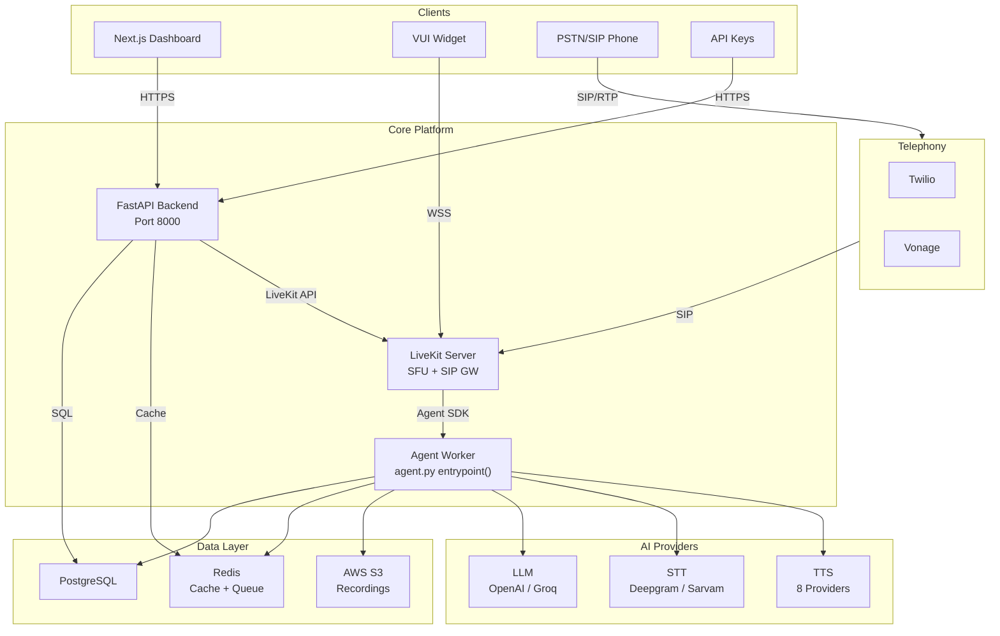
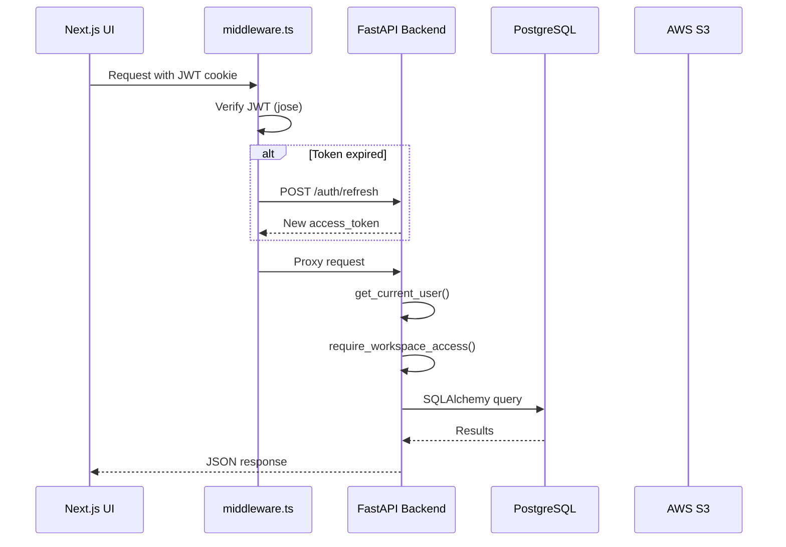
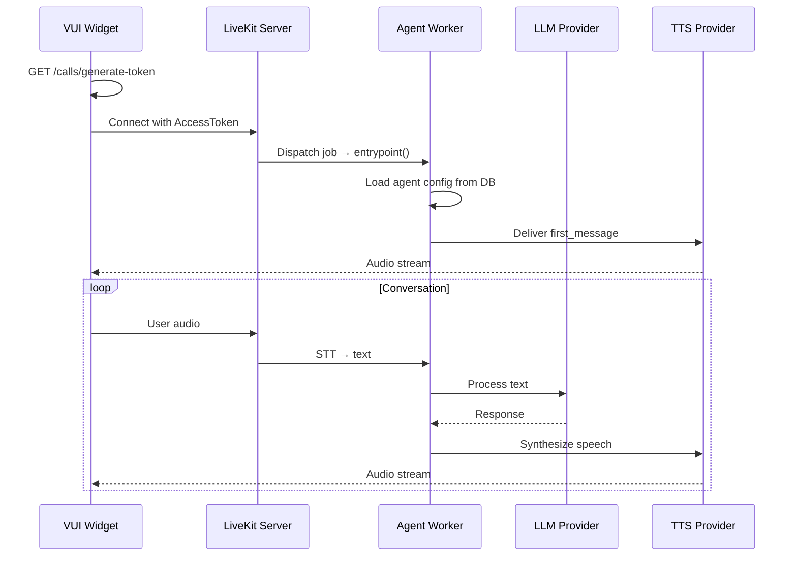
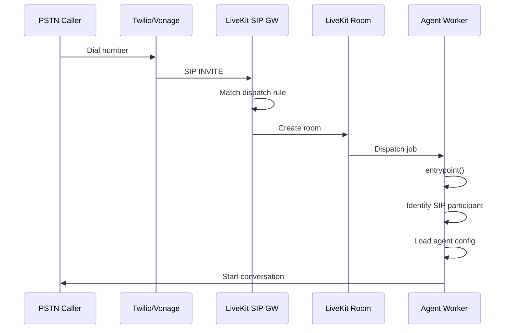
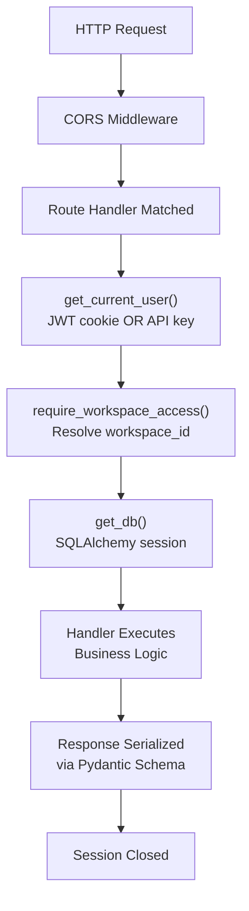
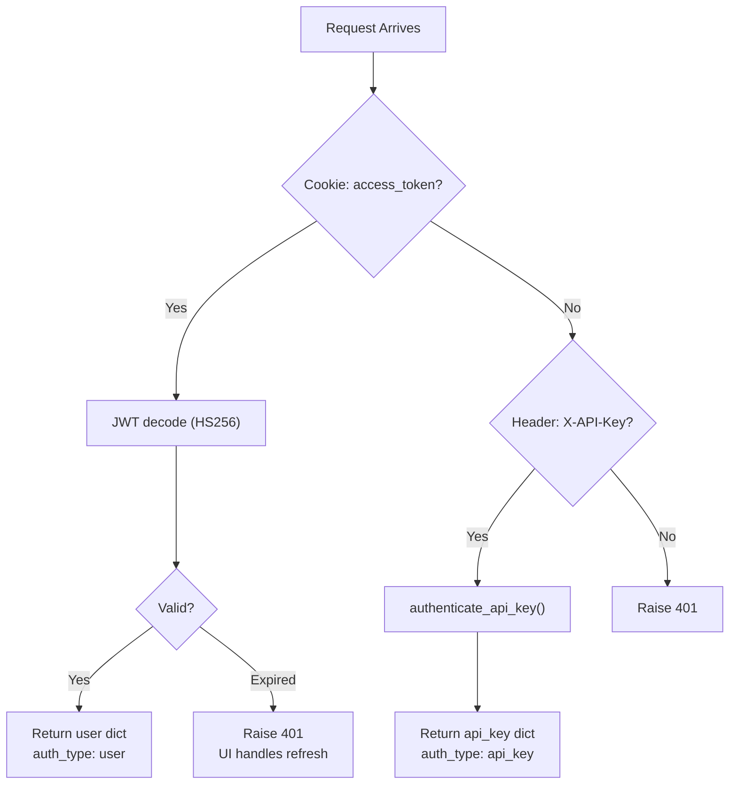

import { Tabs, Tab, Info, Warning, Steps, Step } from "mintlify/components";

## High-Level Architecture

---

## Component Interaction Map

### Frontend → Backend → Database

### Widget → LiveKit → Agent Worker

### Phone Call → SIP → LiveKit → Agent Worker

---

## Runtime Flows

### Application Startup

<Tabs>
  <Tab title="Backend (FastAPI)">
    1. `gunicorn` starts with Uvicorn workers → `app/asgi.py` → `app/main.py`
    2. `lifespan()` context manager initializes `httpx.AsyncClient` singleton
    3. CORS middleware registered (all origins)
    4. 14 routers registered under their prefixes
    5. Health check at `GET /`
  </Tab>
  <Tab title="Agent Worker (LiveKit)">
    1. `livekit-agents` CLI starts the worker process
    2. Worker connects to LiveKit server via `LIVEKIT_URL`
    3. Registers `entrypoint()` as the job handler
    4. Waits for incoming room jobs (dispatch)
  </Tab>
  <Tab title="Celery Workers">
    1. `celery -A app.workers.celery_app.celery worker` starts worker
    2. `celery -A app.workers.celery_app.celery beat` starts scheduler
    3. Connects to Redis as broker/backend
    4. Processes batch dispatch tasks (`dispatch_batch`)
  </Tab>
</Tabs>

### Request Lifecycle (REST API)

### Voice Call Lifecycle

```mermaid
stateDiagram-v2
    [*] --> Setup: Job dispatched
    
    state Setup {
        [*] --> Connect: Connect to room
        Connect --> Detect: Detect call type
        Detect --> LoadConfig: Query PostgreSQL
        LoadConfig --> RenderPrompt: Render system_prompt
        RenderPrompt --> InitPlugins: Init LLM/STT/TTS
    }
    
    Setup --> Session: Plugins ready
    
    state Session {
        [*] --> CreateAgent: Create AgentSession + VAD
        CreateAgent --> StartRecording: LiveKit Egress → S3
        StartRecording --> Greet: Deliver first_message
        Greet --> ConvoLoop: Conversation loop
        ConvoLoop --> ConvoLoop: LLM-driven turns
    }
    
    Session --> Teardown: Disconnect
    
    state Teardown {
        [*] --> StopRec: Stop recording
        StopRec --> GetStatus: Query telephony status
        GetStatus --> Costs: Compute token/costs
        Costs --> Analysis: Run conversation analysis
        Analysis --> Save: Save CallLog to DB
    }
    
    Teardown --> [*]
```

---

## Authentication & Authorization

### Authentication Chain

### Authorization (RBAC)

| Operation | Required Role |
|-----------|--------------|
| View data (calls, agents, reports) | `member` |
| Create/edit agents, SIP, campaigns | `developer` |
| Manage workspaces, invite members | `admin` |
| Platform administration | `superuser` (user flag) |

---

## Data Storage Design

### PostgreSQL (Primary Database)

| Table | Model | Expected Scale |
|-------|-------|---------------|
| `agents` | `Agents` | Hundreds |
| `users` | `User` | Thousands |
| `workspaces` | `Workspace` | Hundreds |
| `user_workspaces` | `UserWorkspace` | Thousands |
| `call_logs` | `CallLog` | **Millions** |
| `logs` (SIP) | `SIP` | Hundreds |
| `campaigns` | `Campaign` | Hundreds |
| `batch_jobs` | `BatchJob` | Thousands |
| `batch_items` | `BatchItem` | **Millions** |
| `chat_logs` | `ChatLog` | Hundreds of K |

### Redis

- `livekit:active_calls` — Integer counter of concurrent calls (TTL: 600s)
- Celery task results and queue messages

### AWS S3

- **Pattern:** `mv/{YYYY}/{MM}/{DD}/{call_log_id}.ogg`
- **Access:** Pre-signed URLs (1-hour expiry)

---

## External API Dependencies

| Service | Purpose | Config Keys |
|---------|---------|-------------|
| **LiveKit** | Real-time media, SIP gateway | `LIVEKIT_API_KEY`, `LIVEKIT_API_SECRET`, `LIVEKIT_URL` |
| **OpenAI** | LLM (GPT-4, GPT-4o), TTS, RAG | `OPENAI_API_KEY` |
| **Groq** | LLM (fast inference) | `GROQ_API_KEY` |
| **Deepgram** | STT (Nova-3), TTS | `DEEPGRAM_API_KEY` |
| **ElevenLabs** | TTS (high quality) | `ELEVENLABS_API_KEY` |
| **Cartesia** | STT, TTS | `CARTESIA_API_KEY` |
| **Sarvam** | STT, TTS (Indian languages) | `SARVAM_API_KEY` |
| **Twilio** | Phone provisioning, SIP trunking | `TWILIO_ACCOUNT_SID`, `TWILIO_AUTH_TOKEN` |
| **Vonage** | Phone provisioning, SIP trunking | `VONAGE_API_KEY`, `VONAGE_API_SECRET` |
| **AWS S3** | Call recording storage | `S3_BUCKET_NAME`, `S3_REGION`, `S3_ACCESS_KEY`, `S3_SECRET_KEY` |
