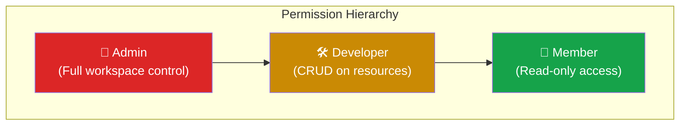
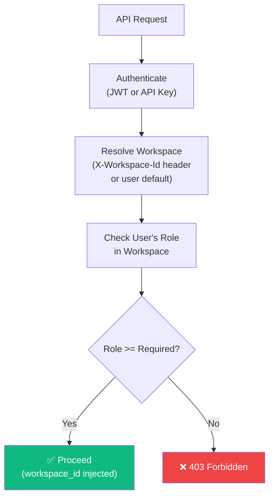

import { Info, Warning } from "mintlify/components";

## RBAC Model

Vaani uses a **Role-Based Access Control** system where permissions are scoped to workspaces:


```mermaid
graph TD
    subgraph "Permission Hierarchy"
        A["👑 Admin\n(Full workspace control)"]
        B["🛠️ Developer\n(CRUD on resources)"]
        C["👤 Member\n(Read-only access)"]
    end

    A --> B
    B --> C

    style A fill:#DC2626,color:#fff
    style B fill:#CA8A04,color:#fff
    style C fill:#16A34A,color:#fff
```

---

## Role Permissions Matrix

| Action | Member | Developer | Admin |
|--------|--------|-----------|-------|
| View agents, calls, reports | ✅ | ✅ | ✅ |
| Create/edit agents | ❌ | ✅ | ✅ |
| Upload knowledge base files | ❌ | ✅ | ✅ |
| Create batch jobs / campaigns | ❌ | ✅ | ✅ |
| Purchase phone numbers | ❌ | ❌ | ✅ |
| Configure SIP trunks | ❌ | ✅ | ✅ |
| Generate API keys | ❌ | ✅ | ✅ |
| Invite/remove members | ❌ | ❌ | ✅ |
| Delete workspace | ❌ | ❌ | ✅ |
| Access admin panel | ❌ | ❌ | ❌ (Superuser only) |

---

## How Authorization Works

Every API request goes through the `require_workspace_access()` dependency:


```mermaid
flowchart TD
    A["API Request"] --> B["Authenticate\n(JWT or API Key)"]
    B --> C["Resolve Workspace\n(X-Workspace-Id header\nor user default)"]
    C --> D["Check User's Role\nin Workspace"]
    D --> E{Role >= Required?}
    E -->|Yes| F["✅ Proceed\n(workspace_id injected)"]
    E -->|No| G["❌ 403 Forbidden"]

    style F fill:#10B981,color:#fff
    style G fill:#EF4444,color:#fff
```

**Each endpoint declares its minimum required role:**

```python
# Example: Only developers and admins can create agents
@router.post("/agents")
async def create_agent(
    workspace_id = Depends(require_workspace_access(WorkspaceRole.developer)),
    ...
):
```

---

## Workspace Scoping

All data queries filter by `workspace_id`, ensuring strict tenant isolation:

- An agent in Workspace A **cannot** be accessed from Workspace B
- Call logs, phone numbers, batch jobs, and campaigns are all workspace-scoped
- API keys inherit the workspace they were created in

---

## Superuser

The **Superuser** flag is a platform-level capability (not a workspace role):
- Set directly on the `User` model (`is_superuser = True`)
- Grants access to the admin panel (`/admin/*` endpoints)
- Can view and manage all workspaces across the platform
- Used for platform operations, not day-to-day usage

<Warning>Superuser access bypasses workspace role checks. Only assign this to platform administrators.</Warning>
