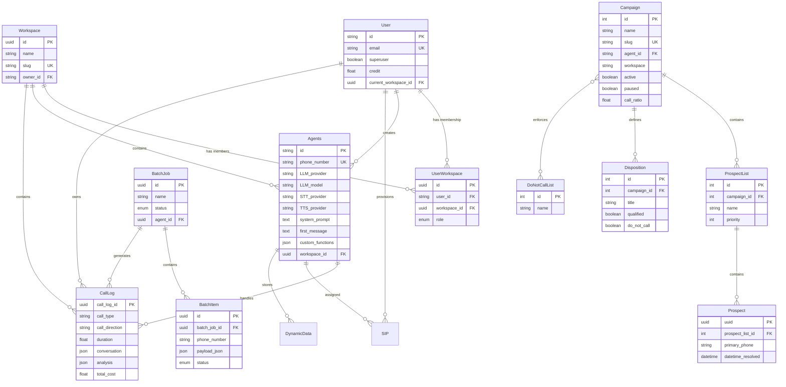

import { Info, Warning, Tabs, Tab } from "mintlify/components";

## Entity-Relationship Diagram



---

## Entity Details

<Tabs>
  <Tab title="User">
    **Table:** `users` &nbsp;|&nbsp; **File:** `app/db/models/user.py`

    | Column | Type | Constraints | Description |
    |--------|------|-------------|-------------|
    | `id` | String | PK, UUID | User identifier |
    | `email` | String | Unique, NOT NULL | Login email |
    | `is_active` | Boolean | Default: True | Account active status |
    | `superuser` | Boolean | Default: False | Platform admin flag |
    | `permissions` | JSON | Nullable | Custom permissions |
    | `credit` | Float | Default: 0 | Account credit balance |
    | `current_workspace_id` | UUID | FK → workspaces.id | Active workspace |
    | `created_at` | DateTime | Default: now | Registration time |
  </Tab>
  <Tab title="Workspace">
    **Table:** `workspaces` &nbsp;|&nbsp; **File:** `app/db/models/workspace.py`

    | Column | Type | Constraints | Description |
    |--------|------|-------------|-------------|
    | `id` | UUID | PK, auto-generated | Workspace identifier |
    | `name` | String | NOT NULL | Display name |
    | `slug` | String | Unique, NOT NULL | URL-friendly identifier |
    | `type` | String | Nullable | "personal" or "team" |
    | `owner_id` | String | FK → users.id | Creator |
    | `created_at` | DateTime | Default: now | Creation timestamp |

    **UserWorkspace** (membership junction table):

    | Column | Type | Description |
    |--------|------|-------------|
    | `user_id` | String | FK → users.id |
    | `workspace_id` | UUID | FK → workspaces.id |
    | `role` | Enum | `admin`, `developer`, `member` |

    **Unique constraint:** `(user_id, workspace_id)` — one membership per workspace
  </Tab>
  <Tab title="Agents">
    **Table:** `agents` &nbsp;|&nbsp; **File:** `app/db/models/agent.py` (187 lines, ~50 columns)

    **Core Identity:**

    | Column | Type | Description |
    |--------|------|-------------|
    | `id` | String (UUID) | Agent identifier |
    | `phone_number` | String (Unique) | Assigned phone number |
    | `agent_name` | String | Display name |

    **LLM Configuration:**

    | Column | Type | Description |
    |--------|------|-------------|
    | `LLM_provider` | String | `"open ai"` or `"groq"` |
    | `LLM_model` | String | `"gpt-4o"`, `"gpt-4o-realtime"`, etc. |
    | `temperature` | Float | LLM temperature (0–2) |
    | `system_prompt` | Text | Agent instructions |
    | `first_message` | Text | Initial greeting |

    **STT/TTS Configuration:**

    | Column | Type | Description |
    |--------|------|-------------|
    | `STT_provider` | String | `"deepgram"`, `"sarvam"`, `"cartesia"` |
    | `TTS_provider` | String | 8 supported providers |
    | `TTS_voice` | String | Voice identifier |

    **Custom Functions & Knowledge Base:**

    | Column | Type | Description |
    |--------|------|-------------|
    | `custom_functions` | JSON | List of webhook-based tools |
    | `knowledge_base` | JSON | List of uploaded files |
    | `rag_enabled` | Boolean | RAG active flag |

    **Session Settings:**

    | Column | Type | Description |
    |--------|------|-------------|
    | `max_call_duration` | Integer | Hard limit (seconds) |
    | `silence_timeout` | Integer | Silence detection threshold |
    | `noise_cancellation_model` | Enum | `"none"` or `"BVE"` |
  </Tab>
  <Tab title="CallLog">
    **Table:** `call_logs` &nbsp;|&nbsp; **File:** `app/db/models/call_log.py` (132 lines)

    | Column | Type | Description |
    |--------|------|-------------|
    | `call_log_id` | UUID | PK |
    | `call_type` | String | `"web"` or `"phone"` |
    | `call_direction` | String | `"inbound"` or `"outbound"` |
    | `duration` | Float | Duration (seconds) |
    | `conversation` | JSON | Message array |
    | `analysis` | JSON | Post-call analysis results |
    | `recording` | String | S3 recording path |
    | `disposition` | String | Call outcome |
    | `cost_llm` | Float | LLM cost |
    | `cost_stt` | Float | STT cost |
    | `cost_tts` | Float | TTS cost |
    | `platform_cost` | Float | Platform surcharge |
    | `total_cost` | Float | Total call cost |
  </Tab>
  <Tab title="SIP">
    **Table:** `logs` &nbsp;|&nbsp; **File:** `app/db/models/sip.py`

    <Warning>Table name is `logs` (historical naming). This has caused confusion with `call_logs`.</Warning>

    | Column | Type | Description |
    |--------|------|-------------|
    | `phone_number` | String | Provisioned number |
    | `provider` | String | `"twilio"` or `"vonage"` |
    | `inbound_trunk_id` | String | LiveKit trunk ID |
    | `outbound_trunk_id` | String | LiveKit trunk ID |
    | `dispatch_rule_id` | String | LiveKit dispatch rule |
    | `workspace_id` | UUID | Workspace scope |
  </Tab>
  <Tab title="Batch">
    **BatchJob** (`batch_jobs`):

    | Column | Type | Description |
    |--------|------|-------------|
    | `id` | UUID | PK |
    | `name` | String | Batch name |
    | `status` | Enum | draft/scheduled/running/completed |
    | `total_items` | Integer | Row count |
    | `scheduled_at` | DateTime | Scheduled dispatch time |

    **BatchItem** (`batch_items`):

    | Column | Type | Description |
    |--------|------|-------------|
    | `batch_job_id` | UUID | FK → batch_jobs.id |
    | `phone_number` | String | Target number |
    | `payload_json` | JSON | Dynamic variables from CSV |
    | `status` | Enum | pending/calling/completed/failed |
    | `error` | String | Error message (if failed) |
  </Tab>
  <Tab title="Campaign (Dialer)">
    <Info>**Coming Soon** — The Campaign Scheduler is in development and available on the Dev instance for testing.</Info>

    **Campaign** (`ppcc_campaign`) — File: `ppcc/web/apps/ppcc/models/realm.py`

    | Column | Type | Description |
    |--------|------|-------------|
    | `name` | String(50) | Campaign display name |
    | `slug` | SlugField | Unique URL-friendly identifier |
    | `active` | Boolean | Whether campaign is running |
    | `paused` | Boolean | Temporarily pause dialing |
    | `agent_id` | String | Vaani agent ID |
    | `workspace` | String | Vaani workspace ID |
    | `email` | String | Campaign owner email |
    | `locale_name` | String(4) | Region (e.g., USCA) |
    | `call_ratio` | Float | Calls per available agent |
    | `dialer_interval` | Integer | Seconds between dialer ticks |
    | `max_active_calls` | Integer | Max concurrent calls |
    | `max_number_calls` | Integer | Max attempts per prospect |
    | `min_time_between_calls` | Integer | Min minutes between retries |
    | `earliest_prospect_time` | Time | Earliest call time (prospect TZ) |
    | `latest_prospect_time` | Time | Latest call time (prospect TZ) |
    | `ignore_states` | String | States to exclude |
    | `filter_holidays` | Boolean | Skip holiday-restricted states |
    | `dupe_days` | Integer | Dedup window in days |
    | `expire_days` | Integer | Prospect expiry in days |
    | `wrap_up_time` | Integer | Agent wrap-up seconds |

    **ProspectList** (`ppcc_prospectlist`) — File: `ppcc/web/apps/ppcc/models/prospect.py`

    | Column | Type | Description |
    |--------|------|-------------|
    | `campaign` | FK → Campaign | Parent campaign |
    | `name` | String | List name |
    | `priority` | Integer | List dialing priority |
    | `slug` | String | URL-friendly identifier |

    **Prospect** (`ppcc_prospect`) — File: `ppcc/web/apps/ppcc/models/prospect.py`

    | Column | Type | Description |
    |--------|------|-------------|
    | `uuid` | UUID | Prospect identifier |
    | `prospect_list` | FK → ProspectList | Parent list |
    | `primary_phone` | String | Phone number |
    | `first_name`, `last_name` | String | Contact name |
    | `disposition` | FK → Disposition | Call outcome |
    | `datetime_resolved` | DateTime | When prospect was resolved |
    | `num_calls` | Integer | Total call attempts |

    **Disposition** (`ppcc_disposition`) — File: `ppcc/web/apps/ppcc/models/disposition.py`

    | Column | Type | Description |
    |--------|------|-------------|
    | `campaign` | FK → Campaign | Parent campaign |
    | `title` | String | Display name |
    | `qualified` | Boolean | Counts as success |
    | `contacted` | Boolean | Prospect was reached |
    | `call_back` | Boolean | Schedule callback |
    | `do_not_call` | Boolean | Add to DNC |
  </Tab>
</Tabs>

---

## Migration Strategy

**Tool:** Alembic (directory: `agent-studio-backend/alembic/`)

```bash
# Generate migration from model changes
alembic revision --autogenerate -m "description"

# Apply migration
alembic upgrade head

# Rollback one step
alembic downgrade -1
```

---

## Data Lifecycle

| Entity | Created | Updated | Deleted |
|--------|---------|---------|---------|
| **Agent** | `POST /agents` | `PUT /agents/{id}` | Hard delete + cascade |
| **Call Log** | Agent worker post-call | Only `notes` field | Not exposed via API |
| **Batch Item** | CSV upload → bulk insert | Dispatcher updates status | Cascade with BatchJob |
| **SIP** | Purchase or trunk register | Delete + recreate LiveKit | `DELETE /phonenumbers/delete_sip` |
| **Campaign** | `POST /api/v/campaign/` | `PATCH /api/v/campaign/{slug}/` | `DELETE /api/v/campaign/{slug}/` |
| **Prospect** | CSV upload → ProspectListUpload | Disposition applied on call | Resolved or expired |
| **ProspectList** | Created with campaign | Priority/name update | Cascade with campaign |
