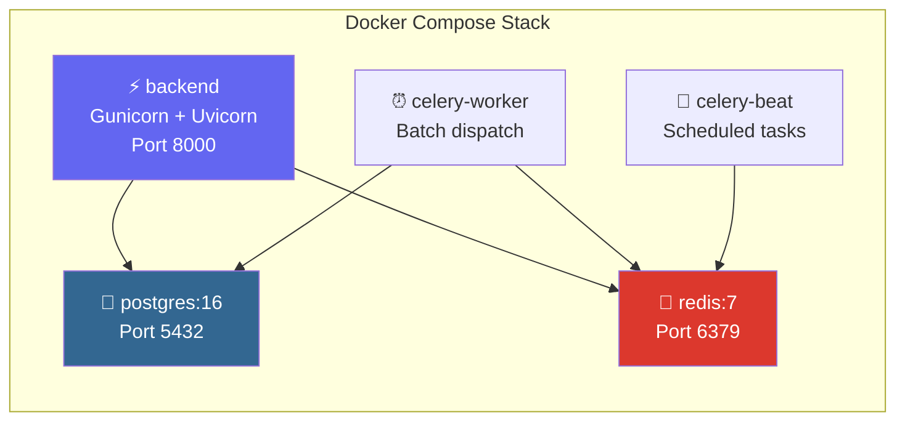
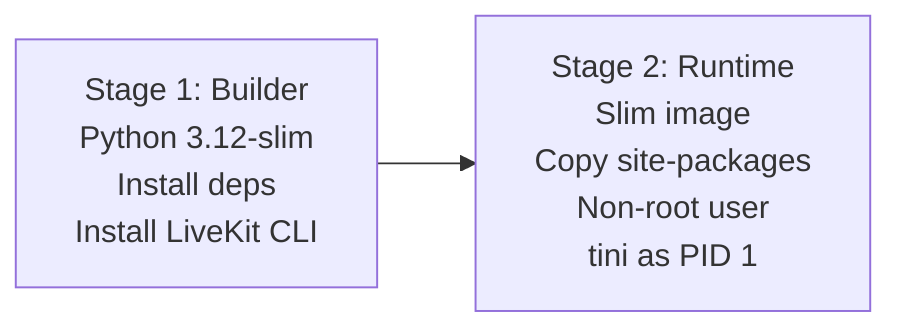

import { Steps, Step, Info, Warning, Tip, CodeGroup, Tabs, Tab } from "mintlify/components";

## Architecture



---

## Quick Start

<Steps>
  <Step title="Configure Environment">
    ```bash
    cd agent-studio-backend
    cp app/env/.env.example app/env/.env
    # Edit .env with your production credentials
    ```
  </Step>

  <Step title="Build & Start">
    ```bash
    docker-compose up -d
    ```

    This starts all 5 services: db, redis, backend, celery-worker, celery-beat.
  </Step>

  <Step title="Run Migrations">
    ```bash
    docker-compose exec backend alembic upgrade head
    ```
  </Step>

  <Step title="Verify">
    ```bash
    # Check all containers are running
    docker-compose ps

    # Test API
    curl http://localhost:8000/docs
    ```
  </Step>
</Steps>

---

## Docker Compose Services

| Service | Image | Port | Resources |
|---------|-------|------|-----------|
| `db` | `postgres:16` | 5432 | `pgdata` volume |
| `redis` | `redis:7` | 6379 | In-memory |
| `backend` | Build from `Dockerfile` | 8000 | 2 Gunicorn workers |
| `celery-worker` | Same as backend | — | Task processing |
| `celery-beat` | Same as backend | — | Periodic scheduler |

---

## Dockerfile Overview

The backend Dockerfile uses a **two-stage build**:



**Key details:**
- Base: `python:3.12-slim-bookworm`
- LiveKit CLI: v2.4.14 (pinned)
- Process manager: `tini` (proper PID 1 signal handling)
- WSGI server: Gunicorn with Uvicorn workers
- Runs as non-root `appuser`

---

## Configuration

### Gunicorn Settings

| Variable | Default | Description |
|----------|---------|-------------|
| `GUNICORN_WORKERS` | 2 | Number of worker processes |
| `GUNICORN_THREADS` | 1 | Threads per worker |
| `GUNICORN_TIMEOUT` | 90 | Request timeout (seconds) |

### Logging

Docker logging is configured with JSON file driver:
- Max file size: 10MB
- Max files: 5 (rotation)
- Application logs: written to `LOG_DIR` mount

---

## Networking

All services communicate over the `pp-net` Docker network (external).

<Info>The `pp-net` network must be created before starting the stack: `docker network create pp-net`</Info>

---

## Commands

<Tabs>
  <Tab title="Lifecycle">
    ```bash
    # Start all services
    docker-compose up -d

    # Stop all services
    docker-compose down

    # Rebuild after code changes
    docker-compose build backend
    docker-compose up -d backend

    # View logs
    docker-compose logs -f backend
    docker-compose logs -f celery-worker
    ```
  </Tab>

  <Tab title="Database">
    ```bash
    # Run migrations
    docker-compose exec backend alembic upgrade head

    # Create a migration
    docker-compose exec backend alembic revision --autogenerate -m "description"

    # Access psql
    docker-compose exec db psql -U vaani agent_studio_db
    ```
  </Tab>

  <Tab title="Debugging">
    ```bash
    # Shell into backend container
    docker-compose exec backend bash

    # Check Redis active calls
    docker-compose exec redis redis-cli GET livekit:active_calls

    # Reset active calls counter
    docker-compose exec redis redis-cli SET livekit:active_calls 0
    ```
  </Tab>
</Tabs>

<Warning>Ensure `pgdata` volume is backed up regularly. Database loss means all agents, calls, and configuration are lost.</Warning>
