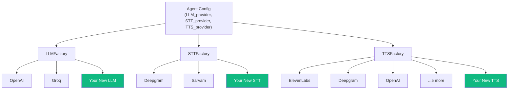

import { Steps, Step, Info, Tip, CodeGroup, Tabs, Tab } from "mintlify/components";

## Architecture

Vaani uses a **factory pattern** to abstract AI providers. Each provider type has a factory class that creates the appropriate SDK instance based on the agent's configuration.



---

## Adding a New TTS Provider (Example)

<Steps>
  <Step title="Install the LiveKit Plugin">
    ```bash
    cd agent-studio-livekit-agent
    pip install livekit-plugins-newprovider
    ```
    
    Add to `requirements.txt`:
    ```
    livekit-plugins-newprovider==1.0.0
    ```
  </Step>

  <Step title="Update the Factory">
    Edit `agent-studio-livekit-agent/plugins/tts.py`:

    ```python
    from livekit.plugins import newprovider as newprovider_tts  # Add import

    class TTSFactory:
        @staticmethod
        def get_instance(agent_config):
            provider = agent_config.get("TTS_provider", "").lower()
            
            # ... existing providers ...
            
            elif provider == "newprovider":
                return newprovider_tts.TTS(
                    api_key=settings.NEWPROVIDER_API_KEY,
                    model=agent_config.get("TTS_model", "default-model"),
                    voice=agent_config.get("TTS_voice", "default-voice"),
                )
    ```
  </Step>

  <Step title="Add Configuration">
    Add the API key to your environment:

    **`agent-studio-livekit-agent/.env`:**
    ```
    NEWPROVIDER_API_KEY=your_api_key_here
    ```

    **`config.py`** or relevant settings file:
    ```python
    NEWPROVIDER_API_KEY = os.getenv("NEWPROVIDER_API_KEY")
    ```
  </Step>

  <Step title="Update Agent Model (Optional)">
    If the provider needs new config fields, update:
    - `app/db/models/agent.py` — add columns
    - `app/db/schemas/agent.py` — add Pydantic fields
    - Run `alembic revision --autogenerate -m "add newprovider fields"`
    - Run `alembic upgrade head`
  </Step>

  <Step title="Update UI Dropdowns">
    Add the new provider to the agent creation/edit form dropdowns in the Next.js dashboard.
  </Step>
</Steps>

---

## Provider Pattern Reference

<Tabs>
  <Tab title="LLM Factory">
    **File:** `plugins/llm.py` → `LLMFactory`

    | Provider | SDK | Method |
    |----------|-----|--------|
    | OpenAI | `livekit-plugins-openai` | `get_instance()` |
    | Groq | `livekit-plugins-groq` | `get_instance()` |

    Also handles: `get_turn_detection()` for VAD configuration.
  </Tab>

  <Tab title="STT Factory">
    **File:** `plugins/stt.py` → `STTFactory`

    | Provider | SDK | Features |
    |----------|-----|----------|
    | Deepgram | `livekit-plugins-deepgram` | Keyword boosting, multi-language |
    | Sarvam | `livekit-plugins-sarvam` | Indian languages |
    | Cartesia | `livekit-plugins-cartesia` | General purpose |
  </Tab>

  <Tab title="TTS Factory">
    **File:** `plugins/tts.py` → `TTSFactory`

    | Provider | SDK |
    |----------|-----|
    | OpenAI | `livekit-plugins-openai` |
    | ElevenLabs | `livekit-plugins-elevenlabs` |
    | Deepgram | `livekit-plugins-deepgram` |
    | Rime | `livekit-plugins-rime` |
    | Cartesia | `livekit-plugins-cartesia` |
    | Sarvam | `livekit-plugins-sarvam` |
    | Murf | `livekit-plugins-murf` |
    | Inworld | `livekit-plugins-inworld` |
  </Tab>
</Tabs>

<Tip>The factory pattern means adding a new provider requires changes in exactly **one file** (the factory) plus environment configuration. No architectural changes needed.</Tip>
