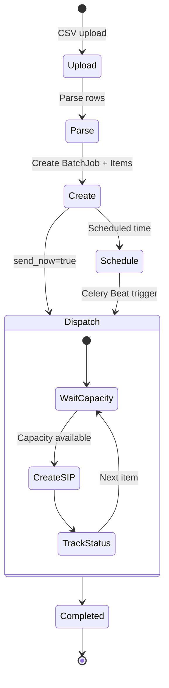
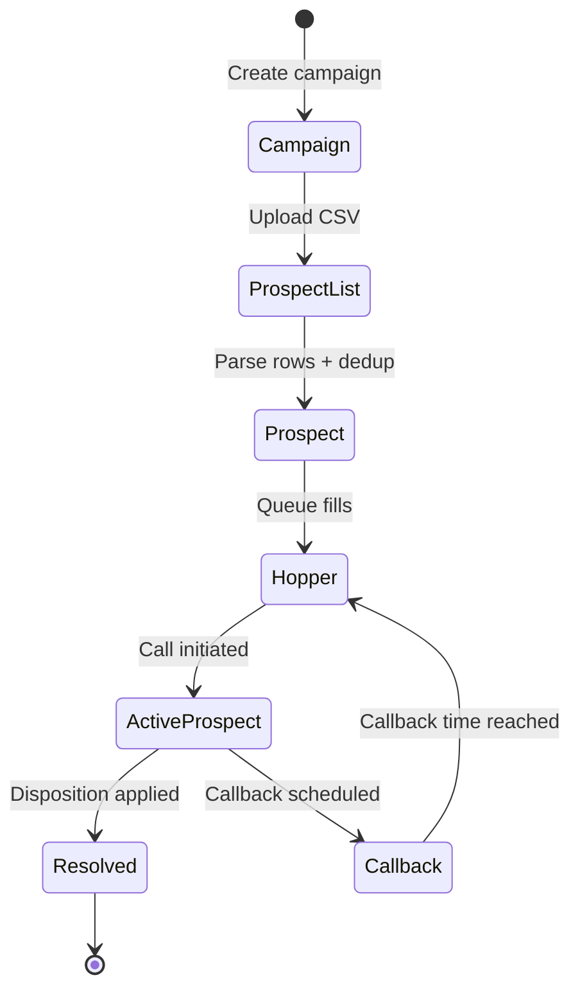
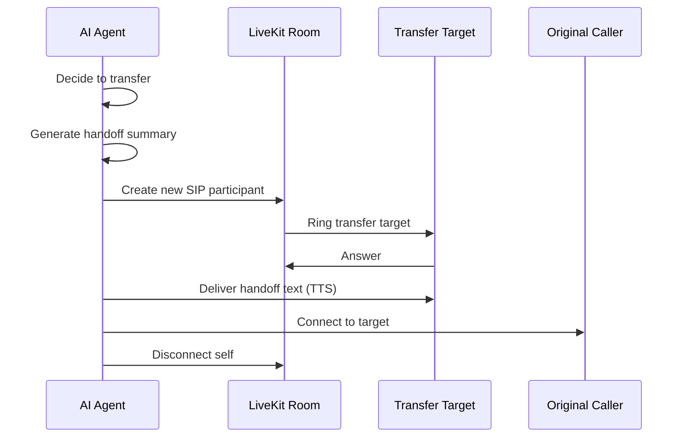

import { Tabs, Tab, Info, Warning } from "mintlify/components";

## Feature 1: Agent Configuration & Management

### Business Description
Users create and configure AI voice agents that handle phone calls and web interactions. Each agent has a unique phone number, LLM/STT/TTS provider selections, system prompt, custom functions, and call behavior settings.

### API Endpoints

| Method | Path | Description |
|--------|------|-------------|
| `GET` | `/agents` | List agents (workspace-scoped) |
| `POST` | `/agents` | Create agent |
| `GET` | `/agents/{id}` | Get agent by ID |
| `PUT` | `/agents/{id}` | Update agent |
| `DELETE` | `/agents/{id}` | Delete agent |
| `POST` | `/agents/{id}/upload` | Upload knowledge base files |
| `GET` | `/agents/{id}/files` | List uploaded files |
| `DELETE` | `/agents/{id}/files/{filename}` | Delete a file |
| `POST` | `/agents/{id}/query` | Query knowledge base (RAG) |

### Key Files

| File | Role |
|------|------|
| `app/router/agent.py` | CRUD endpoints (496 lines) |
| `app/db/models/agent.py` | `Agents` model (~50 columns) |
| `app/db/schemas/agent.py` | `AI_Agent`, `AI_AgentAction` Pydantic schemas |

<Warning>
**Limitations:**
- Single phone number per agent (no multi-number support)
- Knowledge base files stored locally, not in S3
- No agent versioning or rollback
</Warning>

---

## Feature 2: Phone Number Provisioning (SIP Trunking)

### Business Description
Users can search, purchase, and configure phone numbers from Twilio or Vonage. Numbers are connected to LiveKit via SIP trunks for voice call routing.

### Provisioning Flow

### API Endpoints

| Method | Path | Description |
|--------|------|-------------|
| `GET` | `/phonenumbers` | List phone numbers |
| `GET` | `/phonenumbers/search` | Search available numbers |
| `POST` | `/phonenumbers/purchase` | Buy and provision a number |
| `POST` | `/phonenumbers/sip_trunk` | Register existing SIP trunk |
| `PUT` | `/phonenumbers/map_agent` | Map agent to phone number |
| `PUT` | `/phonenumbers/update_sip/{number}` | Update SIP trunk config |
| `DELETE` | `/phonenumbers/delete_sip/{number}` | Delete SIP trunk |

---

## Feature 3: Voice Calls (Inbound & Outbound)

### Business Description
The platform handles real-time voice calls. Inbound calls arrive via SIP trunking; outbound calls are initiated via API. The agent worker manages the full call lifecycle.

### Agent Built-in Tools

| Tool | Purpose |
|------|---------|
| `end_call()` | Terminate the call |
| `transfer_call()` | Cold or warm transfer |
| `look_up_availability()` | Check appointment slots |
| `confirm_appointment()` | Book appointment |
| `detected_answering_machine()` | Handle voicemail detection |
| `custom_function_call()` | Execute webhook-based custom function |

### Call Recording
- Recorded via LiveKit Egress to S3
- Path: `mv/{YYYY}/{MM}/{DD}/{call_log_id}.ogg`
- Playback via pre-signed S3 URL (1-hour expiry)

<Warning>
**Limitations:**
- Recording only in `.ogg` format
- No real-time call monitoring by supervisors
- Disconnect reason detection differs between Twilio and Vonage
</Warning>

---

## Feature 4: Batch Calling

### Business Description
Users upload CSV files with phone numbers and dynamic variables, then schedule or immediately dispatch batch outbound calls with concurrency control.

### Batch Lifecycle

### API Endpoints

| Method | Path | Description |
|--------|------|-------------|
| `GET` | `/batch` | List batch jobs |
| `POST` | `/batch/upload` | Upload CSV + create batch |
| `GET` | `/batch/{id}` | Get batch status + progress |
| `PATCH` | `/batch/{id}` | Update batch schedule |
| `DELETE` | `/batch/{id}` | Delete batch (not running) |

---

## Feature 5: Campaigns (Advanced Call Scheduler)

<Info>**Coming Soon** — The Campaign Scheduler is in development and available on the Dev instance for testing.</Info>

### Business Description
Campaigns provide a full-featured outbound dialer engine (ported from PerfectPitch). Unlike batch jobs, campaigns offer prospect list management, timezone-aware scheduling, DNC compliance, call ratio controls, disposition workflows, and automated reporting.

### Campaign → Prospect Lifecycle

### Dialer Subsystems

| Subsystem | Role | Exchange |
|-----------|------|----------|
| **Ticker** | Emits `CampaignTick` at `dialer_interval` seconds | `TickerExchange` |
| **Hopper** | Fills prospect queue (timezone/DNC/priority filtering) | `TickerExchange` |
| **Dialer** | Originates calls respecting call ratio and dampers | `TickerExchange` / `CombinedTickerExchange` |
| **Scheduler** | Handles scheduling requests and callback coordination | `SchedulingExchange` |

### API Endpoints (Vaani Layer)

| Method | Path | Description |
|--------|------|-------------|
| `GET` | `/api/v/campaign/` | List campaigns (filter by email/workspace) |
| `POST` | `/api/v/campaign/` | Create campaign |
| `GET` | `/api/v/campaign/{slug}/` | Get campaign details |
| `PUT/PATCH` | `/api/v/campaign/{slug}/` | Update campaign |
| `DELETE` | `/api/v/campaign/{slug}/` | Delete campaign |
| `GET` | `/api/v/campaign/{slug}/status/` | Real-time campaign status |
| `POST` | `/api/v/upload/{slug}/` | Upload prospect list CSV |
| `POST` | `/api/v/upload/{uuid}/retry/` | Retry failed upload |
| `POST` | `/api/v/prospect/{uuid}/` | Add single prospect |

### Key Files

| File | Role |
|------|------|
| `ppcc/web/apps/ppcc/models/realm.py` | `Campaign` model (~70 fields) |
| `ppcc/web/apps/ppcc/models/prospect.py` | `Prospect`, `ProspectList`, `ActiveProspect` |
| `ppcc/web/apps/api/v_views/campaign.py` | Campaign CRUD ViewSet |
| `ppcc/web/apps/api/v_views/upload.py` | Prospect list CSV upload |
| `ppcc/amqp/dialer/` | AMQP dialer pipeline (hopper, dialer, scheduler, ticker) |
| `ppcc/stats/models.py` | Campaign reports and statistics |

<Warning>
**Limitations:**
- Manager module is not yet ported (currently commented out)
- Some legacy PerfectPitch fields remain as placeholders (commented out in models)
</Warning>

---

## Feature 6: Workspaces & Multi-Tenancy

### Business Description
The platform supports multiple workspaces for team-based organization with RBAC.

### Roles & Permissions

| Role | Capabilities |
|------|-------------|
| `member` | View agents, calls, reports |
| `developer` | Create/edit agents, SIP, campaigns, batches |
| `admin` | Manage workspace settings, invite/remove members |

---

## Feature 7: Reports & Analytics

### Dashboard Metrics
- Total calls, avg duration, total cost, cost per call
- Time-series call volume data (auto-bucketed)
- Disposition donut charts
- Period-over-period comparisons

| Method | Path | Description |
|--------|------|-------------|
| `GET` | `/reports/dashboard` | Main dashboard metrics |
| `GET` | `/reports/call-summary` | Field-driven call summary |
| `GET` | `/reports/disposition-summary` | Disposition breakdown |
| `GET` | `/reports/workload` | Agent workload (Prometheus metrics) |

---

## Feature 8: Knowledge Base (RAG)

### Flow

---

## Feature 9: Web Chat

Text-based chat interactions with AI agents for testing and non-voice scenarios.

| Method | Path | Description |
|--------|------|-------------|
| `POST` | `/chats` | Send message, get LLM response |
| `GET` | `/chats` | List chat logs (paginated) |

---

## Feature 10: Call Transfer (Warm & Cold)

### Warm Transfer Flow

<Info>
- Warm transfer retries configurable (default: 3 attempts)
- Transfer target must be reachable via SIP
- No three-way conferencing during transfer
</Info>
