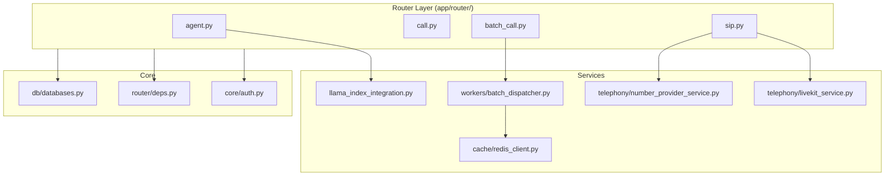

import { Tabs, Tab, Info, Warning } from "mintlify/components";

## Internal Module Dependencies



---

## External Service Integrations

<Tabs>
  <Tab title="LiveKit">
    | Aspect | Detail |
    |--------|--------|
    | **Purpose** | Media server, SIP gateway, room management, Egress (recording) |
    | **SDK** | `livekit-api` (backend), `livekit-agents` (worker), `@livekit/components-react` (widget) |
    | **Config** | `LIVEKIT_API_KEY`, `LIVEKIT_API_SECRET`, `LIVEKIT_URL`, `LIVEKIT_SIP_URI` |
    | **Integration Points** | SIP trunk creation, dispatch rules, outbound SIP participant, room egress, webhook events |
    | **Failure Handling** | LiveKit SIP errors caught and logged; `LiveKitSIPError` exception class |
    | **Critical Files** | `app/services/livekit/livekit_api.py`, `app/services/livekit/livekit_singleton.py` |
  </Tab>
  <Tab title="OpenAI">
    | Aspect | Detail |
    |--------|--------|
    | **Purpose** | LLM (GPT-4, GPT-4o, Realtime), TTS, RAG embeddings |
    | **SDK** | `livekit-plugins-openai`, `openai` (direct), `llama-index` (embeddings) |
    | **Config** | `OPENAI_API_KEY` |
    | **Integration Points** | Agent conversation (streaming), TTS synthesis, knowledge base indexing, post-call analysis |
    | **Failure Handling** | Plugin-level retry; errors propagate to agent session |
  </Tab>
  <Tab title="Twilio">
    | Aspect | Detail |
    |--------|--------|
    | **Purpose** | Phone number provisioning, SIP trunking, call status |
    | **SDK** | `twilio` Python SDK |
    | **Config** | `TWILIO_ACCOUNT_SID`, `TWILIO_AUTH_TOKEN` |
    | **Integration Points** | Number search/purchase, trunk creation, number binding, call status queries |
    | **Failure Handling** | Twilio SDK exceptions caught in service layer |
  </Tab>
  <Tab title="Vonage">
    | Aspect | Detail |
    |--------|--------|
    | **Purpose** | Phone number provisioning, SIP trunking, call status |
    | **SDK** | HTTP requests (no official SDK) |
    | **Config** | `VONAGE_API_KEY`, `VONAGE_API_SECRET`, `VONAGE_ENCRYPTION_KEY` |
    | **Integration Points** | Number search/purchase, SIP trunk setup, call status |
    | **Failure Handling** | HTTP error responses checked; timeout on SIP provisioning |
  </Tab>
  <Tab title="AWS S3">
    | Aspect | Detail |
    |--------|--------|
    | **Purpose** | Call recording storage |
    | **SDK** | `boto3` |
    | **Config** | `S3_BUCKET_NAME`, `S3_REGION`, `S3_ACCESS_KEY`, `S3_SECRET_KEY` |
    | **Key Pattern** | `mv/{YYYY}/{MM}/{DD}/{call_log_id}.ogg` |
    | **Critical Files** | `app/router/call.py:generate_presigned_url()` |
  </Tab>
</Tabs>

### Additional AI Providers

| Provider | SDK | Config Key | Used For |
|----------|-----|-----------|----------|
| Groq | `livekit-plugins-groq` | `GROQ_API_KEY` | LLM |
| Deepgram | `livekit-plugins-deepgram` | `DEEPGRAM_API_KEY` | STT, TTS |
| ElevenLabs | `livekit-plugins-elevenlabs` | `ELEVENLABS_API_KEY` | TTS |
| Cartesia | `livekit-plugins-cartesia` | `CARTESIA_API_KEY` | STT, TTS |
| Sarvam | `livekit-plugins-sarvam` | `SARVAM_API_KEY` | STT, TTS |
| Rime | `livekit-plugins-rime` | `RIME_API_KEY` | TTS |
| Murf | `livekit-plugins-murf` | `MURF_API_KEY` | TTS |
| Inworld | `livekit-plugins-inworld` | `INWORLD_API_KEY` | TTS |

---

## Secrets Management

All secrets are managed via **environment variables**, loaded by `pydantic-settings.BaseSettings` with optional `.env` file support.

```python
# app/core/config/settings.py
DOTENV_PATH = Path(__file__).resolve().parents[2] / "env" / ".env"
ENV = os.getenv("ENV", "prod")

# .env file loaded ONLY in local/dev/development environments
ENV_FILE = DOTENV_PATH if LOAD_DOTENV or ENV in {"local", "dev"} else None
```

### Secret Types
- **SecretStr fields:** `OPENAI_API_KEY`, `S3_ACCESS_KEY`, `JWT_API_SECRET`, `TWILIO_AUTH_TOKEN`, `LIVEKIT_API_SECRET`, etc.
- **Access pattern:** `settings.SECRET_FIELD.get_secret_value()` (prevents accidental logging)
- **Docker:** Production uses `env_file` directive — values never committed to Git

---

## Failure Handling Summary

| Integration | Failure Strategy |
|-------------|-----------------|
| **LiveKit SIP** | Errors caught with `LiveKitSIPError`; logged but may leave orphaned resources |
| **Twilio/Vonage** | SDK/HTTP exceptions caught; returned as error dicts |
| **OpenAI** | Plugin-level handling; streaming errors terminate turn |
| **S3 Upload** | LiveKit Egress handles directly; download errors return `recording: null` |
| **Redis** | Connection errors may break capacity tracking |
| **PostgreSQL** | SQLAlchemy session rollback on exception |
| **Celery** | Auto-retry with `max_retries=3` for batch dispatch |

<Warning>Several integrations catch `Exception` broadly, which can mask unexpected errors. See [Risks & Recommendations](/developer-guide/risks-recommendations) for details.</Warning>
