import { Steps, Step, Info, Warning, Tip, CodeGroup, Tabs, Tab } from "mintlify/components";

## Prerequisites

| Tool | Version | Purpose |
|------|---------|---------|
| Python | 3.12+ | Backend + agent worker |
| Node.js | 18+ | Dashboard UI + VUI widget |
| PostgreSQL | 16 | Primary database |
| Redis | 7+ | Cache + Celery broker |
| Docker | 24+ | Containerized services |
| Git | Latest | Source control |

---

## Architecture Reminder

```mermaid
graph LR
    subgraph "You'll Run Locally"
        A["⚡ FastAPI Backend\nPort 8000"]
        B["🤖 Agent Worker"]
        C["🖥️ Next.js UI\nPort 3000"]
        D["🎤 VUI Widget\nPort 5173"]
    end

    subgraph "Docker (Supporting Services)"
        E["🐘 PostgreSQL\nPort 5432"]
        F["🔴 Redis\nPort 6379"]
    end

    A --> E
    A --> F
    B --> E
    C --> A
    D --> A

    style A fill:#6366F1,color:#fff
    style C fill:#10B981,color:#fff
```



---

## Step-by-Step Setup

<Steps>
  <Step title="Clone the Repository">
    ```bash
    git clone https://github.com/vaani-ai/voice-agent-platform.git
    cd voice-agent-platform
    ```
  </Step>

  <Step title="Start PostgreSQL & Redis">
    The easiest way is Docker:
    ```bash
    cd agent-studio-backend
    docker-compose up db redis -d
    ```
    This starts PostgreSQL 16 on port 5432 and Redis 7 on port 6379.
  </Step>

  <Step title="Set Up Backend">
    ```bash
    cd agent-studio-backend

    # Create virtual environment
    python -m venv venv
    source venv/bin/activate  # Windows: venv\Scripts\activate

    # Install dependencies
    pip install -r requirements.txt

    # Configure environment
    cp app/env/.env.example app/env/.env
    # Edit .env with your credentials (see Environment Variables page)

    # Run database migrations
    alembic upgrade head

    # Start the backend
    uvicorn app.main:app --host 0.0.0.0 --port 8000 --reload
    ```

    <Tip>The `--reload` flag enables hot-reloading. The server restarts automatically when you save code changes.</Tip>
  </Step>

  <Step title="Set Up Agent Worker">
    ```bash
    cd agent-studio-livekit-agent

    # Create virtual environment
    python -m venv venv
    source venv/bin/activate

    # Install dependencies
    pip install -r requirements.txt

    # Configure environment
    cp .env.example .env
    # Edit .env with LiveKit and API keys

    # Start in development mode
    python agent.py dev
    ```

    <Warning>The agent worker requires a running LiveKit server. See the [LiveKit docs](https://docs.livekit.io) for self-hosted setup, or use LiveKit Cloud for development.</Warning>
  </Step>

  <Step title="Set Up Dashboard UI">
    ```bash
    cd agent-studio-ui

    # Install dependencies
    npm install

    # Configure environment
    cp .env.example .env.local
    # Set NEXT_PUBLIC_ML_BACKEND_URL=http://localhost:8000
    # Set JWT_API_SECRET (same as backend)

    # Start dev server
    npm run dev
    ```
    Dashboard is now available at `http://localhost:3000`.
  </Step>

  <Step title="Set Up VUI Widget (Optional)">
    ```bash
    cd agent-studio-vui-widget

    # Install dependencies
    npm install

    # Start dev server
    npm run dev
    ```
    Widget dev server runs at `http://localhost:5173`.
  </Step>
</Steps>

---

## Verify Your Setup

After starting all services, verify everything is working:

| Check | How |
|-------|-----|
| Backend API | `curl http://localhost:8000/docs` — should show Swagger UI |
| Database | `curl http://localhost:8000/agents` — should return `[]` |
| Dashboard | Open `http://localhost:3000` — should show login page |
| Redis | `redis-cli ping` — should return `PONG` |

---

## Running Celery Workers

For batch calling functionality, start the Celery worker and scheduler:

<Tabs>
  <Tab title="Worker">
    ```bash
    cd agent-studio-backend
    celery -A app.workers.celery_app worker --loglevel=info
    ```
  </Tab>
  <Tab title="Beat (Scheduler)">
    ```bash
    cd agent-studio-backend
    celery -A app.workers.celery_app beat --loglevel=info
    ```
  </Tab>
</Tabs>

---

## Common Setup Issues

| Issue | Cause | Fix |
|-------|-------|-----|
| `alembic upgrade` fails | Database doesn't exist | Create DB first: `createdb agent_studio_db` |
| Redis connection refused | Redis not running | Start with `docker-compose up redis -d` |
| JWT errors on UI | Secret mismatch | Ensure `JWT_API_SECRET` is identical in backend and UI |
| Agent worker won't start | Missing LiveKit credentials | Verify `LIVEKIT_URL`, `LIVEKIT_API_KEY`, `LIVEKIT_API_SECRET` |
| S3 URL errors | Stray quotes in env var | Remove surrounding quotes from `S3_REGION` value |
