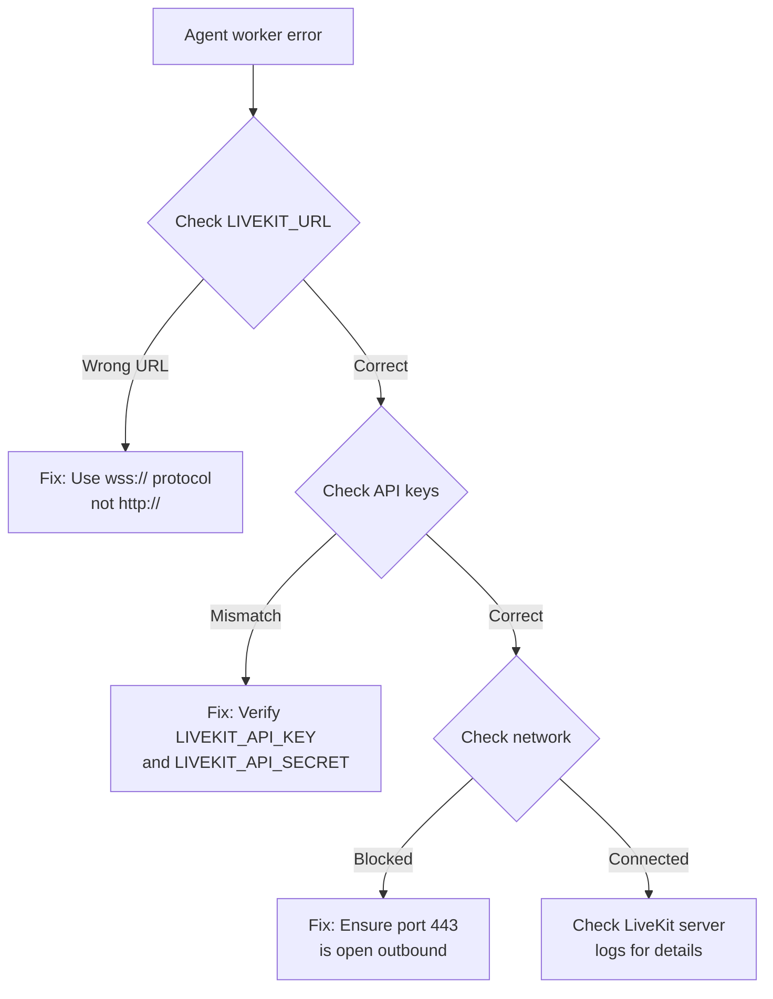
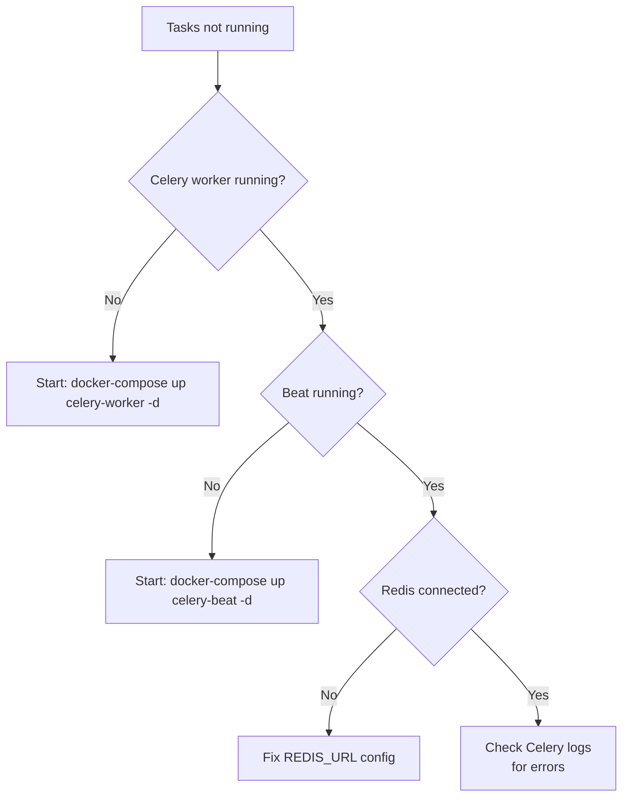

import { Warning, Info, Tip, Steps, Step } from "mintlify/components";

## Setup & Deployment Issues

### Database migration fails with `alembic upgrade head`

**Cause:** Database doesn't exist or migrations are out of sync.

**Fix:**
```bash
# Ensure the database exists
createdb agent_studio_db

# If migrations are out of sync, stamp current state and retry
alembic stamp head
alembic upgrade head
```

---

### Redis connection refused

**Cause:** Redis server not running, or running on a different port.

**Fix:**
```bash
# Start Redis via Docker
docker-compose up redis -d

# Verify connection
redis-cli ping
# Expected: PONG

# Check your REDIS_URL matches the running instance
echo $REDIS_URL
# Should be: redis://localhost:6379/1
```

---

### JWT errors across backend and UI

**Cause:** The `JWT_API_SECRET` is different between services.

**Fix:** Ensure the exact same value is set in:
- `agent-studio-backend/app/env/.env` → `JWT_API_SECRET`
- `agent-studio-ui/.env.local` → `JWT_API_SECRET`

<Warning>Even trailing whitespace or newlines can cause a mismatch. Copy-paste the value directly.</Warning>

---

## Call & Telephony Issues

### Agent worker won't connect to LiveKit



---

### Inbound calls aren't reaching the agent

**Diagnostic steps:**

<Steps>
  <Step title="Check SIP trunk exists">
    Verify the phone number has an inbound trunk and dispatch rule configured:
    ```bash
    curl https://api.vaani.ai/sip -H "Cookie: access_token=TOKEN"
    ```
    Look for the phone number with non-null `inbound_trunk_id` and `dispatch_rule_id`.
  </Step>

  <Step title="Check telephony provider">
    Verify the phone number is properly configured at Twilio/Vonage to route SIP to LiveKit.
  </Step>

  <Step title="Check agent worker">
    Verify at least one agent worker is running and connected to LiveKit.
  </Step>

  <Step title="Check capacity">
    ```bash
    redis-cli GET livekit:active_calls
    ```
    If this equals `MAX_AGENT_SESSIONS`, no more calls can be accepted.
  </Step>
</Steps>

---

### S3 recording URLs return errors

**Cause:** Stray quotes in `S3_REGION` environment variable or wrong credentials.

**Fix:**
```bash
# Check for stray quotes
echo $S3_REGION
# Should be: us-east-1 (no quotes)
# NOT: "us-east-1" or 'us-east-1'

# Verify S3 credentials
aws s3 ls s3://YOUR_BUCKET_NAME/ --region YOUR_REGION
```

<Info>The backend strips surrounding quotes from S3_REGION as a workaround, but it's best to fix the source.</Info>

---

### Outbound call not connecting

**Possible causes:**
1. **No outbound trunk** — the agent's phone number doesn't have an outbound SIP trunk
2. **Invalid target number** — the destination number format is incorrect
3. **At capacity** — `livekit:active_calls` is at the max limit
4. **Provider issue** — Twilio/Vonage account has insufficient balance

---

## Batch & Campaign Issues

### Batch job stuck in "running" state

**Cause:** Celery worker crashed during dispatch.

**Fix:**
```bash
# Check Celery worker status
docker-compose logs celery-worker --tail 50

# Reset active calls if stuck
redis-cli SET livekit:active_calls 0

# Restart Celery worker
docker-compose restart celery-worker
```

---

### Celery tasks not executing



---

## Performance Issues

### High latency in agent responses

| Bottleneck | Symptom | Fix |
|-----------|---------|-----|
| **LLM** | Agent takes 2-3s to respond | Switch to Groq or use `gpt-4o-mini` |
| **TTS** | Lag after agent "thinks" | Switch to Deepgram TTS (lowest latency) |
| **STT** | Words appear late | Ensure Deepgram connection is stable |
| **Network** | Overall slow | Deploy LiveKit closer to users |

<Tip>Monitor latency metrics via `GET /reports/workload` → check `latency_p50_ms` and `latency_p95_ms` for each provider.</Tip>

---

### Phone number format errors

The system expects E.164 format but handles some normalization:
- ✅ `+16505551234`
- ✅ `16505551234` (+ is auto-added for US numbers)
- ❌ `(650) 555-1234` (not yet supported)
- ❌ `650-555-1234` (not yet supported)

<Info>Always use E.164 format (`+[country_code][number]`) for reliable results.</Info>
