import { Card, CardGroup, Info, Tip } from "mintlify/components";

## How Vaani Works

Vaani connects your AI agents to phone calls. When someone calls your agent's number — or when your agent calls out — the platform handles the entire conversation automatically.

```mermaid
flowchart LR
    A["📞 Phone Call"] --> B["Vaani Platform"]
    B --> C["🤖 AI Agent"]
    C --> D["🧠 Understands speech"]
    C --> E["💬 Generates response"]
    C --> F["🔊 Speaks back"]
    
    style B fill:#6366F1,color:#fff
    style C fill:#8B5CF6,color:#fff
```



---

## Key Entities

<CardGroup cols={2}>
  <Card title="Workspace" icon="building">
    Your team's organizational unit. All data — agents, calls, phone numbers — is contained 
    within a workspace. You can belong to multiple workspaces.
  </Card>
  <Card title="Agent" icon="robot">
    An AI-powered virtual assistant configured with a system prompt, an LLM provider, voice settings, 
    and custom tools. Each agent has a unique phone number for receiving calls.
  </Card>
  <Card title="Phone Number" icon="phone">
    A provisioned phone number from Twilio or Vonage, connected to your agent. 
    Incoming calls to this number are automatically handled by the assigned agent.
  </Card>
  <Card title="Call Log" icon="clipboard-list">
    A record of every call — including transcript, recording, cost breakdown, 
    AI-generated summary, and disposition (outcome).
  </Card>
</CardGroup>

---

## The Call Lifecycle

Every voice call follows this lifecycle:


| Phase | What Happens |
|-------|-------------|
| **Connect** | The call is routed to the assigned AI agent |
| **Greeting** | The agent delivers its configured first message |
| **Conversation** | The agent listens, understands, and responds in real-time. It can use custom tools, query the knowledge base, or transfer the call |
| **End** | Either party hangs up, or the agent ends the call |
| **Post-Call** | A recording is saved, costs are calculated, and the conversation is analyzed for sentiment, summary, and disposition |

---

## Roles & Permissions

Vaani uses **Role-Based Access Control (RBAC)** within each workspace:

| Role | What They Can Do |
|------|-----------------|
| **Member** | View agents, call logs, reports, and analytics |
| **Developer** | Everything a Member can do, plus create/edit agents, phone numbers, campaigns, and batch jobs |
| **Admin** | Everything a Developer can do, plus manage workspace settings, invite/remove members, delete workspace |

<Info>Each user can belong to **multiple workspaces** with different roles in each. Switch between workspaces using the workspace selector in the dashboard.</Info>

---

## AI Providers

Vaani lets you mix and match AI providers for each agent:

| Component | Purpose | Available Providers |
|-----------|---------|-------------------|
| **LLM** | Understands conversation and generates responses | OpenAI GPT-4o, Groq |
| **STT** | Converts caller's speech to text | Deepgram, Sarvam, Cartesia |
| **TTS** | Converts agent's text to natural speech | OpenAI, ElevenLabs, Deepgram, Rime, Cartesia, Sarvam, Murf, Inworld |

<Tip>Choose **GPT-4o** for accuracy, **Groq** for speed. For TTS, **ElevenLabs** offers the most natural voices while **Deepgram** provides the lowest latency.</Tip>

---

## Dynamic Variables

Personalize conversations by injecting variables into agent prompts:

```
System Prompt:
"You are calling {{customer_name}} about their appointment on {{appointment_date}}."
```

Variables are filled in automatically from:
- **Outbound calls** — passed when initiating the call
- **Batch calls** — extracted from your uploaded CSV columns
- **Dynamic data** — stored in the platform and matched by phone number

---

## Key Terms

| Term | Meaning |
|------|---------|
| **Disposition** | The outcome of a call (e.g., "completed", "transferred", "no-answer") |
| **Knowledge Base** | Documents uploaded to your agent so it can answer questions using your content |
| **Batch Job** | A set of phone numbers to call automatically, uploaded via CSV |
| **Campaign** | A simpler version of a batch job for quick outbound calling |
| **Custom Function** | A webhook the agent can call during conversations (e.g., check inventory, book appointments) |
| **Warm Transfer** | The agent briefs the human before connecting the caller |
| **Cold Transfer** | The caller is connected directly to the human without briefing |

See the [full glossary](/reference/glossary) for more terms.
