import { Card, CardGroup, Info, Tip } from "mintlify/components";

## Entity Relationship Map


---

## Key Entities

<CardGroup cols={2}>
  <Card title="Workspace" icon="building">
    The top-level organizational unit. All data — agents, calls, phone numbers — is scoped to a workspace. 
    Think of it as a team or company account.
  </Card>
  <Card title="Agent" icon="robot">
    An AI-powered virtual assistant configured with a system prompt, LLM choice, voice settings, 
    and custom tools. Each agent has a unique phone number for receiving calls.
  </Card>
  <Card title="Phone Number (SIP Trunk)" icon="phone">
    A provisioned phone number from Twilio or Vonage, connected to LiveKit via SIP trunking. 
    The number is mapped to an agent to route inbound calls.
  </Card>
  <Card title="Call Log" icon="clipboard-list">
    A record of every call — including transcript, recording URL, token usage, cost breakdown, 
    AI-generated analysis, and disposition.
  </Card>
</CardGroup>

---

## The Call Lifecycle

Every voice call — whether inbound or outbound — follows this lifecycle:


### Phase Breakdown

| Phase | What Happens | Duration |
|-------|-------------|----------|
| **Setup** | Detect call type (SIP vs Web), load agent config, initialize LLM/STT/TTS providers | ~1-2 seconds |
| **Session** | Start recording, deliver greeting, begin background monitors (duration, silence, reminders) | ~1 second |
| **Conversation** | Real-time loop: STT captures speech → LLM generates response → TTS delivers audio | Entire call |
| **Teardown** | Stop recording, compute costs, run AI analysis, save call log + recording to S3 | ~3-5 seconds |

---

## Roles & Permissions

Vaani uses a **Role-Based Access Control (RBAC)** system within each workspace:

```mermaid
graph TD
    A["🔑 Superuser"] --> B["👑 Admin"]
    B --> C["🛠️ Developer"]
    C --> D["👤 Member"]

    style A fill:#DC2626,color:#fff
    style B fill:#EA580C,color:#fff
    style C fill:#CA8A04,color:#fff
    style D fill:#16A34A,color:#fff
```



| Role | What they can do |
|------|-----------------|
| **Member** | View agents, call logs, reports, and analytics |
| **Developer** | Everything a Member can do, plus create/edit agents, phone numbers, campaigns, and batch jobs |
| **Admin** | Everything a Developer can do, plus manage workspace settings, invite/remove members, delete workspace |
| **Superuser** | Platform-level admin — access all workspaces, manage all users (flag on User model, not a workspace role) |

<Info>Each user can belong to **multiple workspaces** with different roles in each. Switch between workspaces using the workspace selector in the dashboard.</Info>

---

## AI Provider Stack

Vaani uses a **factory pattern** that lets you mix and match providers for each agent:


<Tip>Choose **GPT-4o** for accuracy, **Groq** for speed. For TTS, **ElevenLabs** offers the most natural voices while **Deepgram** provides the lowest latency.</Tip>

---

## Dynamic Variables

Personalize conversations by injecting variables into agent prompts at call time:

```
System Prompt:
"You are calling {{customer_name}} about their appointment on {{appointment_date}}.
Their account number is {{account_id}}."
```

Variables are resolved at runtime from:
- **Outbound calls** → passed in the API request body
- **Batch calls** → extracted from CSV columns
- **Dynamic data** → stored in the `dynamic_data` table and matched by phone number

---

## Terminology Quick Reference

| Term | Meaning |
|------|---------|
| **SIP Trunk** | A connection between a phone number and LiveKit for routing voice calls |
| **Dispatch Rule** | A LiveKit rule that matches incoming SIP calls to an agent worker |
| **Egress** | LiveKit's recording service that saves call audio to S3 |
| **RAG** | Retrieval-Augmented Generation — the agent retrieves relevant documents to enhance LLM responses |
| **Disposition** | The outcome of a call (e.g., "successful-transfer", "hung-up", "do-not-call") |
| **VAD** | Voice Activity Detection — detects when a speaker starts/stops talking |

See the [full glossary](/reference/glossary) for 35+ terms.
