import { Info, Card, CardGroup } from "mintlify/components";

## System Architecture

Vaani is a **4-service monorepo** where each component handles a specific responsibility:

```mermaid
graph TB
    subgraph "Clients"
        UI["🖥️ Dashboard (Next.js)"]
        Widget["🎤 VUI Widget (React)"]
        Phone["📞 PSTN / SIP Phone"]
        APIClient["🔑 API Key (External)"]
    end

    subgraph "Backend Services"
        API["⚡ FastAPI Backend\n(REST API, Port 8000)"]
        Worker["🤖 Agent Worker\n(LiveKit Agents SDK)"]
        Celery["⏰ Celery Workers\n(Batch Dispatch)"]
    end

    subgraph "Infrastructure"
        LK["📡 LiveKit Server\n(SFU + SIP Gateway)"]
        PG["🐘 PostgreSQL 16\n(Primary DB)"]
        Redis["🔴 Redis 7\n(Cache + Queue)"]
        S3["☁️ AWS S3\n(Recordings)"]
    end

    subgraph "External APIs"
        LLM["🧠 LLM Providers\n(OpenAI, Groq)"]
        STT["🎤 STT Providers\n(Deepgram, Sarvam)"]
        TTS["🔊 TTS Providers\n(ElevenLabs, +7 more)"]
        Telco["📱 Telephony\n(Twilio, Vonage)"]
    end

    UI -->|HTTPS| API
    Widget -->|WebSocket| LK
    Phone -->|SIP/RTP| Telco
    APIClient -->|HTTPS| API
    Telco -->|SIP| LK
    API -->|SQL| PG
    API -->|Cache| Redis
    API -->|Recordings| S3
    LK -->|Agent SDK| Worker
    Worker -->|SQL| PG
    Worker -->|Streaming| LLM
    Worker -->|Streaming| STT
    Worker -->|Streaming| TTS
    Worker -->|Egress| S3
    Celery -->|Tasks| Redis
    Celery -->|SIP Calls| LK
```

---

## Component Breakdown

<CardGroup cols={2}>
  <Card title="FastAPI Backend" icon="server">
    **14 REST API routers** handling agents, calls, phone numbers, batch jobs, campaigns, workspaces, 
    reports, chats, webhooks, auth, and admin. Runs on Gunicorn with Uvicorn workers.
  </Card>
  <Card title="LiveKit Agent Worker" icon="microchip">
    The real-time AI engine. Connects to LiveKit rooms, processes audio via STT, generates responses 
    via LLM, and delivers audio via TTS. Handles recording, transfers, and post-call analytics.
  </Card>
  <Card title="Next.js Dashboard" icon="browser">
    Full-featured management UI for configuring agents, viewing call logs, managing phone numbers, 
    launching batch campaigns, and monitoring analytics. Protected by JWT authentication.
  </Card>
  <Card title="VUI Widget" icon="microphone">
    Embeddable React component that connects to agents via WebRTC. Can be dropped into any website 
    for voice-based customer interaction without requiring phone infrastructure.
  </Card>
</CardGroup>

---

## Data Flow: Inbound Phone Call

```mermaid
sequenceDiagram
    participant Caller as 📞 Caller
    participant Telco as Twilio/Vonage
    participant LK as LiveKit SIP GW
    participant Agent as 🤖 Agent Worker
    participant LLM as 🧠 GPT-4o
    participant STT as 🎤 Deepgram
    participant TTS as 🔊 ElevenLabs
    participant DB as 🐘 PostgreSQL
    participant S3 as ☁️ S3

    Caller->>Telco: Dials +1 (650) 555-1234
    Telco->>LK: SIP INVITE
    LK->>LK: Match dispatch rule
    LK->>Agent: Assign room job
    Agent->>DB: Load agent config
    Agent->>TTS: "Hello! How can I help?"
    TTS-->>Caller: Audio greeting

    loop Conversation
        Caller->>STT: Speech audio
        STT-->>Agent: Transcribed text
        Agent->>LLM: User message + context
        LLM-->>Agent: AI response
        Agent->>TTS: Response text
        TTS-->>Caller: Response audio
    end

    Caller->>Agent: Hangs up
    Agent->>S3: Upload recording
    Agent->>LLM: Analyze conversation
    Agent->>DB: Save call log
```

---

## Data Flow: Outbound Batch Call

```mermaid
sequenceDiagram
    participant User as 👤 User
    participant API as ⚡ Backend API
    participant DB as 🐘 PostgreSQL
    participant Redis as 🔴 Redis
    participant Celery as ⏰ Celery Worker
    participant LK as 📡 LiveKit
    participant Agent as 🤖 Agent Worker

    User->>API: POST /batch/upload (CSV)
    API->>DB: Create BatchJob + BatchItems
    API->>Redis: dispatch_batch.delay(batch_id)
    Redis->>Celery: Pick up task

    loop For each phone number
        Celery->>Redis: Check livekit:active_calls
        alt Capacity available
            Celery->>LK: Create SIP participant
            LK->>Agent: Assign room job
            Agent->>Agent: Run conversation
            Agent->>DB: Save call log
            Celery->>DB: Update BatchItem status
        else At capacity
            Celery->>Celery: Wait 5 seconds, retry
        end
    end

    Celery->>DB: Update BatchJob → completed
```

---

## Infrastructure Requirements

| Component | Technology | Purpose |
|-----------|-----------|---------|
| **Application Server** | Python 3.12 + Gunicorn + Uvicorn | REST API serving |
| **Real-time Server** | LiveKit (self-hosted or cloud) | WebRTC SFU + SIP gateway |
| **Primary Database** | PostgreSQL 16 | All application data |
| **Cache / Queue** | Redis 7 | Caching, Celery broker, active call tracking |
| **Object Storage** | AWS S3 | Call recordings |
| **Task Queue** | Celery (worker + beat) | Batch dispatch, scheduled tasks |
| **Container Runtime** | Docker + Docker Compose | Deployment orchestration |

<Info>All components are containerized and defined in `docker-compose.yml`. A single `docker-compose up` brings up the full backend stack.</Info>
