import { Card, CardGroup, Steps, Step } from "mintlify/components";

## What is Vaani?

Vaani is a **multi-tenant SaaS platform** for creating AI voice agents that conduct real-time phone conversations. 
Your agents can answer inbound calls, make outbound calls, transfer to humans, query knowledge bases, 
and execute custom actions — all powered by configurable LLM, Speech-to-Text, and Text-to-Speech providers.

```mermaid
flowchart LR
    A["📞 Phone Call"] --> B["LiveKit SIP Gateway"]
    B --> C["🤖 AI Agent Worker"]
    C --> D["🧠 LLM (GPT-4o / Groq)"]
    C --> E["🎤 STT (Deepgram)"]
    C --> F["🔊 TTS (ElevenLabs)"]
    C --> G["📚 Knowledge Base"]
    C --> H["⚡ Custom Functions"]
    D --> C
    E --> C
    F --> C
```



---

## Key Capabilities

<CardGroup cols={3}>
  <Card title="AI Voice Agents" icon="robot">
    Configure agents with custom prompts, personalities, and ~50 behavioral settings. 
    Choose from 10+ LLM, STT, and TTS providers.
  </Card>
  <Card title="Phone Integration" icon="phone">
    Provision phone numbers via Twilio or Vonage. Handle inbound and outbound calls 
    with SIP trunking through LiveKit.
  </Card>
  <Card title="Call Transfers" icon="arrow-right-arrow-left">
    Warm and cold transfers to human agents with automatic failover, retry logic, 
    and handoff summaries.
  </Card>
  <Card title="Batch Calling" icon="list-check">
    Upload CSV files and dispatch hundreds of calls with concurrency control, 
    scheduling, and per-call status tracking.
  </Card>
  <Card title="Knowledge Base (RAG)" icon="book">
    Upload documents (PDF, DOCX, TXT) and let your agent retrieve relevant 
    context during conversations using RAG.
  </Card>
  <Card title="Analytics Dashboard" icon="chart-mixed">
    Track call volume, duration, costs, dispositions, and agent performance 
    with real-time analytics.
  </Card>
</CardGroup>

---

## Quick Start

<Steps>
  <Step title="Create an Agent">
    Configure your AI agent with a system prompt, LLM provider, and voice settings 
    in the dashboard.
  </Step>
  <Step title="Connect a Phone Number">
    Purchase or connect a phone number via Twilio or Vonage and link it to your agent.
  </Step>
  <Step title="Start Receiving Calls">
    Your agent is live! Inbound calls to the number are automatically handled by the AI agent.
  </Step>
</Steps>

---

## Try a Quick API Call

Generate a LiveKit access token for a web-based voice session:

```bash
curl -X GET "https://api.vaani.ai/calls/generate-token?phone=+16505551234&id=session_001" \
  -H "Cookie: access_token=YOUR_JWT_TOKEN"
```

```json Response
{
  "identity": "web_session_001",
  "accessToken": "eyJhbGciOiJIUzI1NiIsInR5cCI6IkpXVCJ9..."
}
```

---

## Explore the Docs

<CardGroup cols={2}>
  <Card title="Quickstart Guide" icon="rocket" href="/getting-started/quickstart">
    Get your first agent up and running in under 5 minutes.
  </Card>
  <Card title="API Reference" icon="code" href="/api-reference/overview">
    Complete endpoint documentation with examples for every API.
  </Card>
  <Card title="User Guide" icon="book-open" href="/user-guide/agents">
    Step-by-step guides for every feature in the platform.
  </Card>
  <Card title="Developer Setup" icon="terminal" href="/developer-guide/local-setup">
    Set up the full development environment locally.
  </Card>
</CardGroup>
