import { Info, Warning, Tip, CodeGroup, Steps, Step } from "mintlify/components";

## Authentication Flow

```mermaid
sequenceDiagram
    participant User as 👤 User
    participant UI as 🖥️ Dashboard
    participant API as ⚡ Backend
    participant DB as 🐘 Database

    User->>UI: Enter email + password
    UI->>API: POST /auth/login
    API->>DB: Verify credentials
    DB-->>API: User record
    API-->>UI: Set httpOnly cookies (access_token + refresh_token)
    UI->>UI: Redirect to dashboard

    Note over UI,API: Subsequent requests include cookies automatically

    UI->>API: GET /agents (with cookie)
    API->>API: Decode JWT → extract user_id
    API->>DB: Load user by user_id
    API-->>UI: Agent list
```



---

## Authentication Methods

### 1. JWT Token (Cookie-Based)

The primary auth method for dashboard users.

**How it works:**
1. User logs in with email/password via `POST /auth/login`
2. Backend creates a JWT signed with `HS256` algorithm using `JWT_API_SECRET`
3. Token is set as an `httpOnly` cookie named `access_token`
4. A `refresh_token` cookie is also set for token renewal
5. All subsequent requests include the cookie automatically

**Token contents:**
```json
{
  "sub": "550e8400-e29b-41d4-a716-446655440000",
  "email": "user@example.com",
  "exp": 1739234400
}
```

<Info>The `sub` claim contains the user's UUID, which is used to look up the full user record on each request.</Info>

### 2. API Key (Header-Based)

For server-to-server integrations and external API access.

```bash
curl -X GET "https://api.vaani.ai/agents" \
  -H "x-api-key: vk_live_abc123def456"
```

See [API Keys](/security/api-keys) for details.

---

## Login

<CodeGroup>
```bash curl
curl -X POST "https://api.vaani.ai/auth/login" \
  -H "Content-Type: application/json" \
  -d '{
    "email": "user@example.com",
    "password": "your_password"
  }' \
  -c cookies.txt
```

```json Response
{
  "email": "user@example.com",
  "user_id": "550e8400-e29b-41d4-a716-446655440000"
}
# Cookies set: access_token, refresh_token
```
</CodeGroup>

---

## Signup

<CodeGroup>
```bash curl
curl -X POST "https://api.vaani.ai/auth/signup" \
  -H "Content-Type: application/json" \
  -d '{
    "name": "John Smith",
    "email": "john@example.com",
    "password": "secure_password_123",
    "phone_number": "+16505551234"
  }'
```

```json Response (201)
{
  "user_id": "new-uuid",
  "email": "john@example.com",
  "name": "John Smith"
}
```
</CodeGroup>

---

## Token Refresh

When the access token expires, the UI automatically calls the refresh endpoint:

```bash
curl -X POST "https://api.vaani.ai/auth/refresh" \
  -H "Cookie: refresh_token=YOUR_REFRESH_TOKEN"
```

A new `access_token` cookie is set in the response.

---

## Auth Chain


<Warning>The `JWT_API_SECRET` must be identical across the backend and UI. A mismatch will cause all authenticated requests to fail with 401 errors.</Warning>
