import { Steps, Step, Info, Warning, Tip, CodeGroup } from "mintlify/components";

## Overview

Batch calling lets you upload a spreadsheet of phone numbers and dynamic variables, then dispatch calls at scale. The system handles concurrency, capacity limits, scheduling, and per-item status tracking.

```mermaid
flowchart LR
    A["📄 Upload CSV"] --> B["📋 Create Batch Job"]
    B --> C{Send Now?}
    C -->|Yes| D["⏰ Celery Worker\nDispatches calls"]
    C -->|No| E["📅 Scheduled\nfor later"]
    E --> D
    D --> F["📞 Calls executed\nwith concurrency control"]
    F --> G["📊 View results\nper phone number"]
    
    style A fill:#6366F1,color:#fff
    style G fill:#10B981,color:#fff
```



---

## CSV Format

Your CSV file should include a `phone_number` column and any dynamic variable columns:

```csv
phone_number,customer_name,appointment_date,account_id
+14155551234,John Smith,2026-02-15,ACC-001
+14155555678,Jane Doe,2026-02-16,ACC-002
+14155559012,Bob Wilson,2026-02-17,ACC-003
```

- **First column** must be `phone_number`
- **Additional columns** become dynamic variables (injected into the agent's system prompt)
- **Phone format:** E.164 recommended (+1XXXXXXXXXX)

---

## Creating a Batch Job

<Steps>
  <Step title="Upload CSV">
    Go to **Batch Calling** → **Upload** and select your CSV file.
  </Step>

  <Step title="Configure the Batch">
    | Setting | Description |
    |---------|-------------|
    | **Name** | Display name for this batch (e.g., "Feb Appointment Reminders") |
    | **Agent** | Select the agent that will make the calls |
    | **Agent Number** | Phone number to call from |
    | **Schedule** | Choose "Send Now" or pick a future date/time |
    | **Timezone** | Your local timezone for scheduling |
  </Step>

  <Step title="Review and Launch">
    - Review the parsed phone numbers and variables
    - Click **Send Now** to start immediately, or **Schedule** for later
    - The batch is sent to the Celery task queue for processing
  </Step>
</Steps>

---

## How Dispatch Works

```mermaid
sequenceDiagram
    participant API as ⚡ Backend
    participant Redis as 🔴 Redis
    participant Celery as ⏰ Celery
    participant LK as 📡 LiveKit

    API->>Redis: dispatch_batch.delay(batch_id)
    Redis->>Celery: Worker picks up task
    
    loop For each BatchItem
        Celery->>Redis: GET livekit:active_calls
        alt count < MAX_AGENT_SESSIONS
            Celery->>LK: Create SIP participant
            LK->>LK: Connect call + agent
            Note over Celery: Status → "calling"
        else At capacity
            Note over Celery: Wait 5 seconds
            Celery->>Redis: Check again
        end
    end
    
    Celery->>API: BatchJob → "completed"
```



**Concurrency control:** The dispatcher checks Redis `livekit:active_calls` before each call. 
If at capacity (`MAX_AGENT_SESSIONS`), it waits and retries automatically.

---

## Batch Statuses

| Batch Status | Meaning |
|-------------|---------|
| `draft` | Saved but not submitted |
| `scheduled` | Scheduled for a future time |
| `running` | Currently dispatching calls |
| `completed` | All calls processed |

| Item Status | Meaning |
|------------|---------|
| `pending` | Waiting to be called |
| `calling` | Currently in a call |
| `completed` | Call finished successfully |
| `failed` | Call failed (error recorded) |

---

## Monitoring Batch Progress

View real-time progress on the batch details page:
- Total items vs. completed/failed/pending
- Per-item status with call IDs
- Error messages for failed items
- Link to individual call logs for completed calls

<Warning>You cannot delete a batch that is currently running. Wait for it to complete or manually stop the Celery worker.</Warning>

<Tip>For large batches (1000+ numbers), consider scheduling during off-peak hours. The concurrency limit ensures you don't overwhelm the system, but processing will take longer.</Tip>
