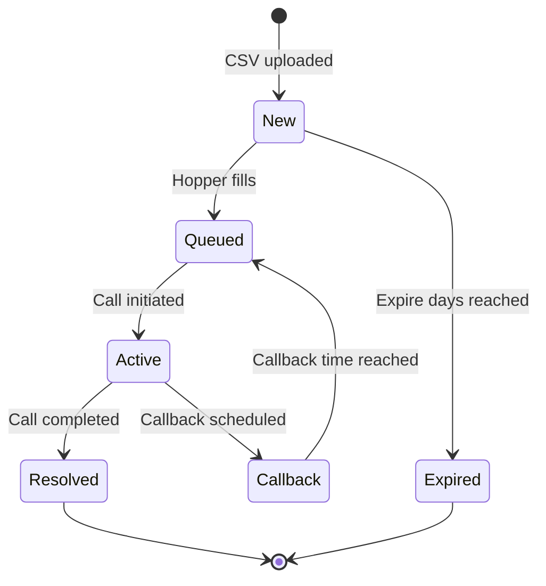

import { Steps, Step, Info, Warning, Tip } from "mintlify/components";

<Warning>**Coming Soon** — The advanced Campaign Scheduler is currently in development and available on the **Dev instance** for testing. It will be released to production in the coming weeks.</Warning>

## Overview

Campaigns let you manage large-scale outbound calling with a full-featured dialer engine. Instead of simple "add numbers and call" lists, campaigns provide:

- **Prospect list management** — Upload CSV files, deduplicate, set priorities, and track per-prospect status
- **Timezone-aware scheduling** — Dial windows that respect each prospect's local time
- **DNC compliance** — Do-not-call lists enforced before every call
- **Intelligent dialing controls** — Call ratios, damping, max concurrent calls, and retry limits
- **Disposition workflows** — Categorize call outcomes, schedule callbacks, flag DNC removals
- **Automated reporting** — Scheduled campaign reports delivered to your inbox


---

## Creating a Campaign

<Steps>
  <Step title="Create Campaign">
    Go to **Campaigns** → **Create New**. Provide:
    - **Name** — Descriptive campaign name (e.g., "February Appointment Reminders")
    - **Locale** — Region for the campaign (e.g., US/Canada). This determines timezone rules and phone format. **Cannot be changed after creation.**
    - **Agent** — Select the AI agent that handles calls
    - **Workspace** — The workspace this campaign belongs to
  </Step>

  <Step title="Set Dialing Windows">
    Configure when prospects can be called based on *their* local time:
    - **Earliest call time** — Default 9:00 AM in the prospect's timezone
    - **Latest call time** — Default 9:00 PM in the prospect's timezone
    - **State restrictions** — Optionally block dialing to specific states
    - **Holiday filtering** — Automatically skip states that prohibit telemarketing on holidays
  </Step>

  <Step title="Upload Prospect Lists">
    Upload one or more CSV files containing phone numbers and contact data. See [Prospect Lists](#prospect-lists) for CSV format and options.
  </Step>

  <Step title="Configure Dialing Rules">
    Fine-tune how the dialer operates. See [Dialing Controls](#dialing-controls) for all available settings.
  </Step>

  <Step title="Start the Campaign">
    Activate the campaign to begin dialing. The system automatically manages the call queue, respects timezone windows, and enforces all configured rules.
  </Step>
</Steps>

---

## Prospect Lists

Prospect lists are collections of contacts to be called. Each campaign can have multiple lists with different priorities.

### CSV Format

Your CSV should include a phone number column and any additional contact fields:

```csv
primary_phone,first_name,last_name,city,state,zip_code
+14155551234,John,Smith,San Francisco,CA,94102
+12125555678,Jane,Doe,New York,NY,10001
+13125559012,Bob,Wilson,Chicago,IL,60601
```

### Upload Options

| Setting | Description |
|---------|-------------|
| **Deduplication** | Duplicate phone numbers within the same campaign are automatically removed |
| **Dupe days** | How many days a matching phone number is considered a duplicate (default: 90 days). Set to -1 to disable |
| **Expire days** | Prospects expire and stop being called after this many days (default: 90) |
| **List priority** | Higher-priority lists are dialed first (0–100) |
| **Batch splitting** | Large uploads are automatically split into processable batches |

### Prospect Lifecycle



---

## Dialing Controls

Fine-tune the dialer behavior for each campaign:

| Setting | Default | Description |
|---------|---------|-------------|
| **Call ratio** | 1.0 | Ratio of outgoing calls to available agent sessions. Higher values = more aggressive dialing |
| **Dialer interval** | 10 sec | Seconds between each dialer tick (2–15 seconds) |
| **Max active calls** | 0 (unlimited) | Maximum concurrent calls for this campaign |
| **Max calls per prospect** | 10 | How many times a prospect can be called before giving up |
| **Min time between calls** | 30 min | Minimum wait between call attempts to the same prospect |
| **Wrap-up time** | 3 sec | Seconds given to the agent between calls |
| **Hopper expiry** | 30 min | How long a prospect stays in the active queue before being recycled |
| **Fill interval** | 5 min | How often the system refills the call queue with new prospects |

### Damper Controls

Dampers automatically reduce the call ratio when the system detects over-dialing:

| Damper Mode | Behavior |
|-------------|----------|
| **Disabled** | No damping — dialer runs at full call ratio |
| **Waiting Stations** | Reduces ratio when a percentage of agents are idle and waiting for calls |

<Tip>Start with a call ratio of 1.0 and increase gradually. A ratio above 1.5 may cause calls to connect before an agent is available.</Tip>

---

## Do Not Call (DNC)

Campaigns support DNC compliance at multiple levels:

1. **DNC Lists** — Assign one or more DNC lists to a campaign. Phone numbers on these lists are skipped during dialing.
2. **DNC Disposition** — Set a specific disposition that automatically adds a prospect to the DNC list when applied.
3. **Check on Dial** — When enabled, the system verifies DNC status immediately before placing each call.

<Warning>You must set a **DNC Disposition** on the campaign for DNC enforcement to work during prospect upload. Without it, matching numbers will still be loaded.</Warning>

---

## Dispositions

Dispositions categorize the outcome of each call. Create custom dispositions per campaign:

| Property | Description |
|----------|-------------|
| **Title** | Display name (e.g., "Interested", "Not Home", "Do Not Call") |
| **Qualified** | Whether this counts as a successful outcome |
| **Contacted** | Whether the prospect was actually reached |
| **Callback** | Whether to schedule a follow-up call |
| **Do Not Call** | Whether to add the prospect to the DNC list |

---

## Campaign States

| State | Description |
|-------|-------------|
| **Active** | Campaign is running and accepting calls |
| **Paused** | Dialing is temporarily stopped; can be resumed |
| **Inactive** | Campaign is deactivated |
| **Archived** | Campaign is archived and hidden from default views |

### Status Check

You can check a campaign's real-time status:

| Status | Meaning |
|--------|---------|
| **Running** | Actively dialing prospects |
| **Stopped** | Active campaign with prospects remaining but no calls in progress |
| **Completed** | All prospects have been resolved |
| **Inactive** | Campaign is not active |

---

## Reporting

Set up automated campaign reports to be emailed on a schedule:

| Schedule | When reports are generated |
|----------|---------------------------|
| **End of Dialing** | After the dialing window closes each day |
| **Midnight** | At midnight each day |
| **Disabled** | No automatic reports |

Reports can be exported in CSV format, optionally compressed (ZIP or GZ), and delivered to one or more email addresses.

---

## Campaigns vs. Batch Calling

| Feature | Campaigns (New) | Batch Calling |
|---------|----------------|---------------|
| **Dialing Engine** | Full dialer with hopper, scheduler, and ticker | Celery worker dispatch |
| **Prospect Management** | Lists with priorities, dedup, expiry | Flat phone number list |
| **Timezone Awareness** | Per-prospect timezone filtering | No |
| **DNC Compliance** | Built-in DNC lists and enforcement | No |
| **Call Ratio Control** | Configurable ratio with dampers | Fixed concurrency limit |
| **Dispositions** | Full disposition workflow with callbacks | Basic status tracking |
| **Reporting** | Scheduled automated reports | Manual review |
| **Best For** | Full-scale outbound campaigns | Quick one-off call lists |

<Info>Campaigns provide a full-featured dialer for production use. Batch Calling remains available for simpler, one-off call lists. For any new outbound calling project, we recommend using Campaigns.</Info>
