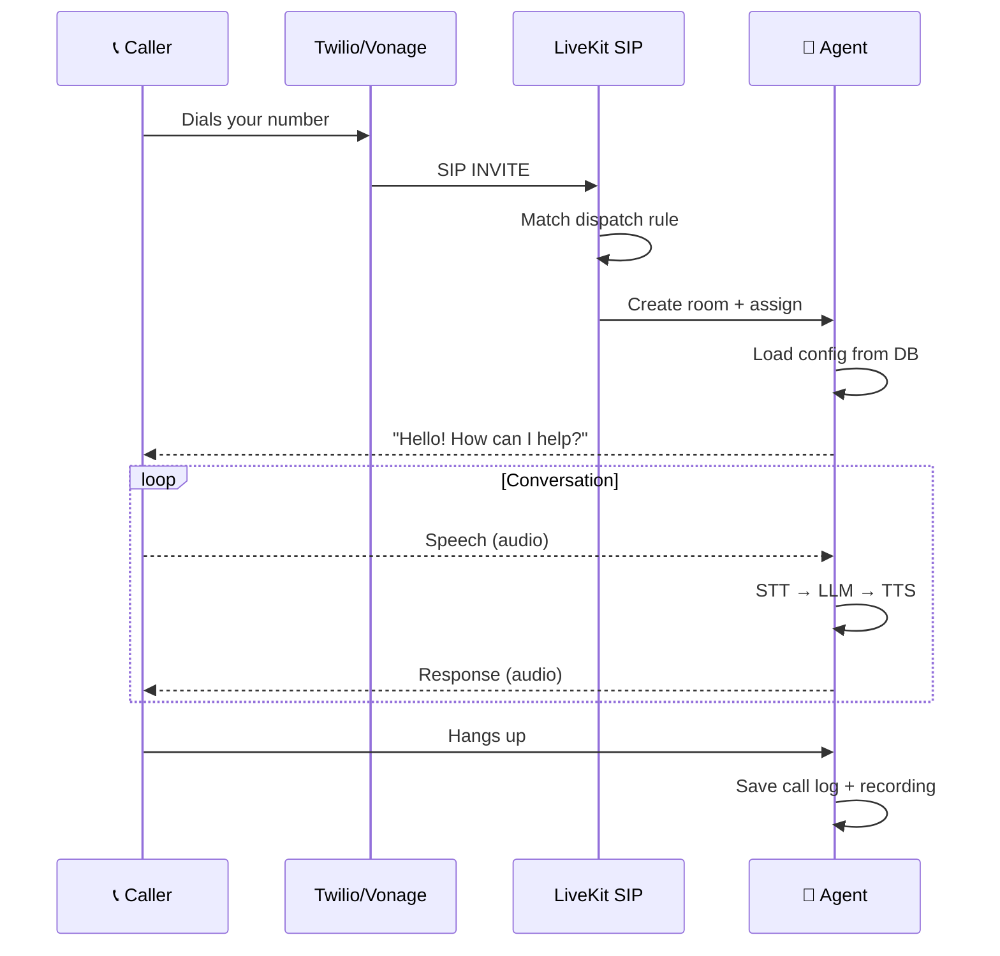

import { Info, Tip, Steps, Step } from "mintlify/components";

## How Inbound Calls Work

When someone calls a phone number mapped to your agent, the call is automatically routed to an AI agent worker:

---

## What Happens During an Inbound Call

<Steps>
  <Step title="Call Arrives">
    The telephony provider (Twilio/Vonage) receives the PSTN call and sends a SIP INVITE to LiveKit.
  </Step>

  <Step title="Routing">
    LiveKit's dispatch rule matches the phone number to the correct inbound trunk and creates a new room.
  </Step>

  <Step title="Agent Connects">
    An available agent worker picks up the room job, identifies the SIP participant, and loads the agent's configuration from the database.
  </Step>

  <Step title="Greeting">
    The agent delivers the configured **first message** via TTS. The caller hears the greeting.
  </Step>

  <Step title="Conversation">
    The real-time conversation loop runs:
    - **STT** converts the caller's speech to text
    - **LLM** generates an intelligent response based on the system prompt and conversation history
    - **TTS** converts the response to speech
    - The caller hears the response
  </Step>

  <Step title="Call Ends">
    When the call ends (caller hangs up, agent decides, or max duration reached), the system:
    - Stops recording and uploads to S3
    - Computes token usage and costs
    - Runs AI-based conversation analysis
    - Saves the complete call log
  </Step>
</Steps>

---

## Background Monitors

During every call, the agent worker runs these background tasks:

| Monitor | What it does |
|---------|-------------|
| **Max Duration** | Disconnects the call after `max_call_duration` seconds |
| **Silence Timeout** | Disconnects if no speech is detected for `silence_timeout` seconds |
| **Inactive Reminder** | Sends a reminder prompt if the agent is idle too long |
| **Disconnect Monitor** | Detects if the caller hangs up unexpectedly |

---

## Call Recording

All calls are automatically recorded via LiveKit Egress:
- Format: `.ogg` audio
- Storage: AWS S3 at path `mv/{year}/{month}/{day}/{call_log_id}.ogg`
- Playback: Available in the dashboard via time-limited pre-signed URLs

<Info>Recordings are available within seconds of the call ending. Pre-signed URLs expire after 1 hour but are regenerated on each page view.</Info>

---

## Viewing Call Details

After a call, go to **Call Logs** to see:
- Full conversation transcript (each message timestamped)
- AI-generated analysis: sentiment, summary, key topics, disposition
- Cost breakdown: LLM tokens, STT duration, TTS characters
- Recording player
- Caller's phone number, call duration, and disconnect reason
