import { Steps, Step, Info, Tip } from "mintlify/components";

## How It Works

Knowledge Base uses **Retrieval-Augmented Generation (RAG)** to give your agent access to your documents during conversations. When a caller asks a question, the agent searches your uploaded documents for relevant information and includes it in its response.

```mermaid
flowchart LR
    A["📄 Upload\nDocuments"] --> B["🔍 LlamaIndex\nIndexes content"]
    B --> C["📦 Vector\nEmbeddings stored"]
    
    D["📞 Caller asks\na question"] --> E["🔎 Agent searches\nthe index"]
    E --> F["📋 Relevant chunks\nretrieved"]
    F --> G["🧠 LLM generates\nresponse with context"]
    G --> H["🔊 TTS delivers\nanswer"]
    
    style A fill:#6366F1,color:#fff
    style H fill:#10B981,color:#fff
```

---

## Setting Up Knowledge Base

<Steps>
  <Step title="Navigate to Agent">
    Go to **Agents** → select your agent → **Knowledge Base** tab.
  </Step>

  <Step title="Upload Documents">
    Supported formats:
    - PDF (`.pdf`)
    - Word Documents (`.docx`)
    - Text Files (`.txt`)

    Drag and drop or click to upload. Multiple files can be uploaded at once.
  </Step>

  <Step title="Enable RAG">
    Toggle **RAG Enabled** to activate knowledge base retrieval during calls.
  </Step>

  <Step title="Test">
    Use the **Query** feature to test retrieval:
    - Enter a sample question
    - View the retrieved chunks and sources
    - Verify the agent finds the right information
  </Step>
</Steps>

---

## How Retrieval Works

1. Uploaded documents are split into chunks and converted to **vector embeddings** using OpenAI
2. Embeddings are stored in a local file-based index (LlamaIndex)
3. During a call, when the agent decides it needs information, it:
   - Converts the user's question to an embedding
   - Finds the most similar chunks from the index
   - Injects the relevant text into the LLM prompt as context
4. The LLM uses this context to generate an informed response

---

## Best Practices

<Tip>
- **Keep documents focused** — upload specific product docs, not entire websites
- **Update regularly** — re-upload when your information changes
- **Test queries** — verify retrieval accuracy before going live
- **Combine with system prompt** — tell the agent when to use the knowledge base vs. general knowledge
</Tip>

---

## Limitations

- Documents are stored on the local filesystem (not S3)
- Index rebuilds when files are added/removed (may take a few seconds for large documents)
- Currently uses OpenAI embeddings — requires `OPENAI_API_KEY`
- No support for spreadsheets, images, or audio files
