import { Info, Warning, CodeGroup } from "mintlify/components";

## Overview

Outbound calls let your agent proactively call phone numbers. Use cases include:
- Appointment reminders
- Follow-up calls
- Lead qualification
- Payment collection

```mermaid
flowchart LR
    A["👤 You trigger call\n(Dashboard or API)"] --> B["⚡ Backend API"]
    B --> C["📡 LiveKit\nCreate SIP Participant"]
    C --> D["📞 Outbound Trunk\nDials customer"]
    D --> E["📱 Customer answers"]
    E --> F["🤖 Agent starts\nconversation"]
    
    style A fill:#6366F1,color:#fff
    style F fill:#10B981,color:#fff
```



---

## Making an Outbound Call

### Via Dashboard
1. Go to **Agents** → select your agent
2. Click **Make Call**
3. Enter the target phone number
4. Optionally add dynamic variables (customer name, account number, etc.)
5. Click **Dial**

### Via API

<CodeGroup>
```bash curl
curl -X POST "https://api.vaani.ai/calls/outbound_call" \
  -H "Content-Type: application/json" \
  -H "Cookie: access_token=YOUR_JWT_TOKEN" \
  -d '{
    "agent_phone_number": "+16505551234",
    "phone_number_to_dial": "+14155559876",
    "dynamic_variables": {
      "customer_name": "Jane Smith",
      "appointment_date": "February 15, 2026",
      "account_id": "ACC-12345"
    }
  }'
```

```json Response
{
  "call_uuid": "a1b2c3d4-e5f6-7890-abcd-ef1234567890",
  "dynamic_variables": {
    "customer_name": "Jane Smith",
    "appointment_date": "February 15, 2026",
    "account_id": "ACC-12345"
  }
}
```
</CodeGroup>

---

## Dynamic Variables

Personalize outbound calls by passing dynamic variables. Any `{{variable_name}}` in the system prompt or first message gets replaced:

**System Prompt:**
```
You are calling {{customer_name}} to remind them about 
their appointment on {{appointment_date}}.
```

**At call time, becomes:**
```
You are calling Jane Smith to remind them about 
their appointment on February 15, 2026.
```

Variables can come from:
- **API request body** → `dynamic_variables` field
- **Batch call CSV** → column headers become variable names
- **Dynamic data table** → pre-stored per phone number

---

## Call Transfers

During a call, the agent can transfer to a human if configured:

```mermaid
flowchart TD
    A["🤖 Agent decides\nto transfer"] --> B{Transfer Type?}
    B -->|Cold| C["Immediately connect\ncaller to target"]
    B -->|Warm| D["Create new SIP\nparticipant in room"]
    D --> E["Deliver handoff\nbriefing to target"]
    E --> F["Connect caller\nto target"]
    F --> G["Agent disconnects"]
    C --> G
    
    style A fill:#6366F1,color:#fff
    style G fill:#10B981,color:#fff
```



| Type | Behavior |
|------|----------|
| **Cold Transfer** | Caller immediately connected to the target number |
| **Warm Transfer** | Agent creates a new call to the target, delivers a summary of the conversation, then connects the original caller |

<Warning>Transfer targets must be reachable via SIP. The warm transfer retries up to 3 times (configurable) if the target doesn't answer.</Warning>
