import { Steps, Step, Info, Warning, Tabs, Tab, Card, CardGroup } from "mintlify/components";

## How Phone Numbers Work

Phone numbers are the bridge between the public telephone network (PSTN) and your AI agents. When someone calls your number, the call flows through your telephony provider and LiveKit's SIP gateway to reach your agent.

---

## Provisioning a New Number

<Steps>
  <Step title="Choose a Provider">
    <CardGroup cols={2}>
      <Card title="Twilio" icon="phone-volume">
        Best for US/Canada numbers. Largest global coverage. Easy SIP trunk setup with automatic binding.
      </Card>
      <Card title="Vonage" icon="phone-flip">
        Competitive international rates. SIP trunk setup requires application + termination URI configuration.
      </Card>
    </CardGroup>
  </Step>

  <Step title="Search Available Numbers">
    1. Go to **Phone Numbers** → **Purchase**
    2. Select your provider and country
    3. Enter an area code (optional)
    4. Browse available numbers
  </Step>

  <Step title="Purchase and Auto-Provision">
    Click **Purchase** on a number. The system automatically:
    1. Buys the number from the provider
    2. Creates an **Inbound SIP Trunk** on LiveKit
    3. Creates a **Dispatch Rule** to route calls to your agent worker
    4. Creates an **Outbound SIP Trunk** for outgoing calls
    5. Saves the configuration to your workspace

    <Info>All three LiveKit resources (inbound trunk, dispatch rule, outbound trunk) are created automatically. No manual SIP configuration needed.</Info>
  </Step>

  <Step title="Map to an Agent">
    After purchase, map the number to an agent:
    1. Click **Map to Agent** next to the number
    2. Select the agent from the dropdown
    3. Inbound calls to this number will now be handled by the selected agent
  </Step>
</Steps>

---

## Registering an Existing SIP Trunk

If you already have a SIP trunk from another provider:

<Steps>
  <Step title="Gather SIP Credentials">
    You'll need:
    - SIP address (domain)
    - Phone number (E.164 format: +1XXXXXXXXXX)
    - Auth username and password (if required)
  </Step>

  <Step title="Register the Trunk">
    Go to **Phone Numbers** → **Register SIP Trunk** and fill in:
    
    | Field | Example | Required |
    |-------|---------|----------|
    | SIP Address | sip.provider.com | ✅ |
    | Phone Number | +16505551234 | ✅ |
    | Provider | Custom | ✅ |
    | Auth Username | my_sip_user | Optional |
    | Auth Password | my_sip_pass | Optional |
    | Krisp Enabled | true | Optional |
    | Label | "Main Office Line" | Optional |
  </Step>
</Steps>

<Warning>When updating a SIP trunk's configuration, the system deletes the old LiveKit resources and creates new ones. There may be a brief interruption during this process.</Warning>

---

## Managing Phone Numbers

| Action | How |
|--------|-----|
| **View all numbers** | Phone Numbers page — shows all provisioned numbers with their status and mapped agent |
| **Map to agent** | Click the number → select an agent |
| **Update config** | Click the number → edit SIP address, auth credentials, or krisp settings |
| **Delete** | Click delete — removes the LiveKit trunks and the database record |

---

## SIP Trunk Anatomy

Each phone number creates three LiveKit resources:

```mermaid
graph TD
    PN["📞 Phone Number\n+1(650)555-1234"] --> IT["📥 Inbound Trunk\nReceives calls from PSTN"]
    PN --> OT["📤 Outbound Trunk\nMakes calls to PSTN"]
    IT --> DR["🔀 Dispatch Rule\nRoutes to agent worker"]
    
    style PN fill:#6366F1,color:#fff
    style IT fill:#10B981,color:#fff
    style OT fill:#F59E0B,color:#fff
    style DR fill:#EF4444,color:#fff
```

| Resource | Purpose |
|----------|---------|
| **Inbound Trunk** | Tells LiveKit to accept SIP calls from this number |
| **Dispatch Rule** | Routes matched calls to an available agent worker |
| **Outbound Trunk** | Allows the agent to make outgoing calls via this number |
