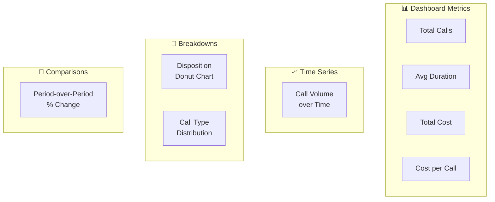

import { Info, Tabs, Tab, Card, CardGroup } from "mintlify/components";

## Dashboard Overview

The analytics dashboard provides real-time visibility into your calling operations:

---

## Key Metrics

<CardGroup cols={2}>
  <Card title="Call Volume" icon="phone">
    Total inbound + outbound calls over the selected time period. Filterable by agent, call type, and date range.
  </Card>
  <Card title="Average Duration" icon="clock">
    Mean call length in seconds. Useful for identifying agents that need prompt tuning.
  </Card>
  <Card title="Total Cost" icon="dollar-sign">
    Combined LLM + STT + TTS + platform costs across all calls.
  </Card>
  <Card title="Disposition Analysis" icon="chart-pie">
    Breakdown of call outcomes: successful transfer, hung up, voicemail, do-not-call, etc.
  </Card>
</CardGroup>

---

## Available Reports

<Tabs>
  <Tab title="Dashboard">
    The main dashboard shows:
    - Summary cards (total calls, avg duration, total cost, cost per call)
    - Time-series line chart with auto-bucketed intervals
    - Disposition donut charts
    - Period-over-period comparison (current vs. previous window)

    **Filters:** Date range, call type (web/phone), specific agent
  </Tab>

  <Tab title="Call Summary">
    Field-driven report — select which metrics to include:
    - Total calls, total duration, average duration
    - Token counts (LLM, STT, TTS)
    - Cost breakdowns by provider
    - Latency metrics

    **Use case:** Detailed cost analysis by agent or time period
  </Tab>

  <Tab title="Disposition Summary">
    Analyze call outcomes by disposition type:
    - Select which dispositions to include
    - See counts, percentages, and trends
    - Filter by date range and agent

    **Use case:** Compliance reporting, campaign effectiveness measurement
  </Tab>

  <Tab title="Agent Workload">
    Real-time operational metrics from Prometheus:
    - Active agent sessions
    - CPU and memory utilization
    - STT/TTS/LLM latency (P50, P95, P99)
    - Request rates

    **Use case:** Infrastructure monitoring, capacity planning
  </Tab>
</Tabs>

---

## Cost Tracking

Every call includes a detailed cost breakdown:

| Metric | Source | Description |
|--------|--------|-------------|
| **LLM Cost** | Token count × model pricing | Input + output tokens |
| **STT Cost** | Audio duration × provider pricing | Seconds of speech recognized |
| **TTS Cost** | Character count × provider pricing | Characters synthesized to speech |
| **Platform Cost** | Fixed surcharge | Per-call platform fee |
| **Total Cost** | Sum of all above | Complete call cost |

<Info>Cost calculation happens automatically during the post-call teardown phase. Pricing rates are embedded in the cost computation logic.</Info>

---

## Exporting Data

Export call logs as CSV for external analysis:
1. Go to **Call Logs** → apply your desired filters
2. Click **Export CSV**
3. Download the file with all call details

The export includes all fields: timestamps, duration, transcript, costs, disposition, and agent info.
