import { Steps, Step, Info, Warning } from "mintlify/components";

## What is a Workspace?

A workspace is the top-level organizational unit in Vaani. All data — agents, calls, phone numbers, batch jobs — is scoped to a workspace. Think of it as a company account or team project.

```mermaid
graph TD
    W["🏢 Workspace: Acme Corp"]
    W --> A1["🤖 Agent: Sales Bot"]
    W --> A2["🤖 Agent: Support Bot"]
    W --> P1["📞 +1(650)555-1234"]
    W --> P2["📞 +1(415)555-5678"]
    W --> B1["📋 Batch: Feb Reminders"]
    W --> U1["👤 Alice (Admin)"]
    W --> U2["👤 Bob (Developer)"]
    W --> U3["👤 Carol (Member)"]
    
    style W fill:#6366F1,color:#fff
```

---

## Creating a Workspace

When you first sign up, you'll create your first workspace. To create additional workspaces:

<Steps>
  <Step title="Navigate to Workspace Settings">
    Click the workspace selector in the sidebar → **Create Workspace**.
  </Step>
  <Step title="Enter Details">
    - **Name:** Your team or company name
    - **Slug:** URL-friendly identifier (auto-generated from name)
    - **Type:** "personal" or "team"
  </Step>
  <Step title="You're the Admin">
    You are automatically assigned the **Admin** role in the new workspace.
  </Step>
</Steps>

---

## Roles & Permissions

| Role | View Data | Create/Edit Agents | Manage Members | Delete Workspace |
|------|-----------|-------------------|---------------|-----------------|
| **Member** | ✅ | ❌ | ❌ | ❌ |
| **Developer** | ✅ | ✅ | ❌ | ❌ |
| **Admin** | ✅ | ✅ | ✅ | ✅ |

---

## Managing Members

### Inviting Members (Admin only)

<Steps>
  <Step title="Go to Members">
    Navigate to **Workspace Settings** → **Members**.
  </Step>
  <Step title="Invite">
    Enter the email address and select a role (Member, Developer, or Admin).
  </Step>
  <Step title="Done">
    If the user already has a Vaani account, they're added immediately. Otherwise, an invitation is sent.
  </Step>
</Steps>

### Removing Members

Admins can remove any member except:
- **Themselves**, if they're the only admin (prevents orphaned workspaces)

<Warning>Removing a member does not delete their data (agents, call logs). The data remains in the workspace.</Warning>

---

## Switching Workspaces

If you belong to multiple workspaces:
1. Click the workspace selector in the sidebar
2. Choose the workspace you want to work in
3. All data in the dashboard updates to reflect the selected workspace

Your **active workspace** is saved to your profile, so you'll return to the same workspace on your next login.

---

## Multi-Tenancy

Vaani enforces strict data isolation between workspaces:
- Every API request is scoped to the user's active workspace
- Agents, phone numbers, calls, and batches cannot be accessed across workspaces
- API keys are workspace-scoped (each key belongs to exactly one workspace)

<Info>Superusers (platform admins) can view all workspaces for administrative purposes. This is a platform-level flag, not a workspace role.</Info>
